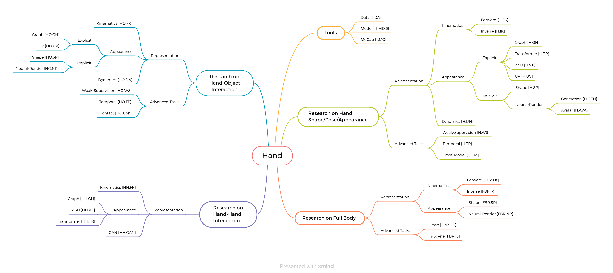
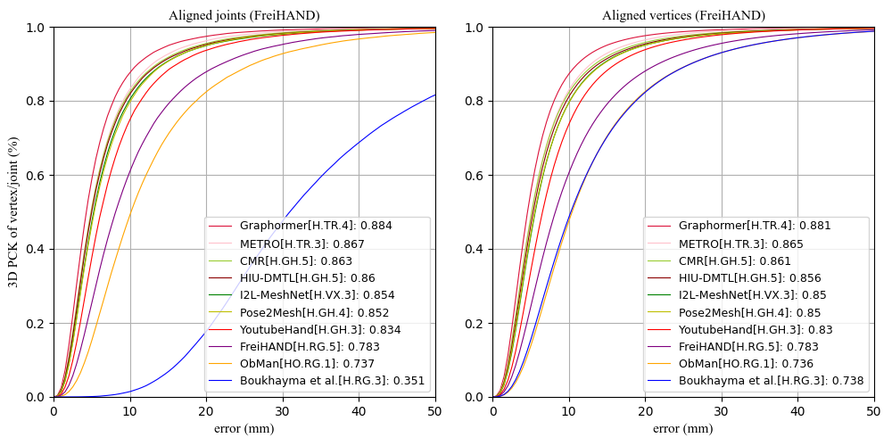
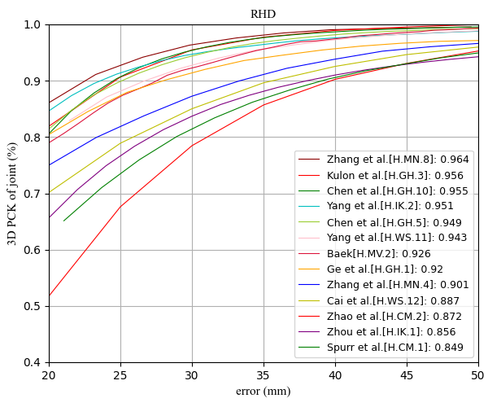

# Recent Progress in 3D Hand Tasks 

A complete paper list for hand pose can be found [here](https://github.com/xinghaochen/awesome-hand-pose-estimation). This repo focuses on some subject areas, ideas, and works. Although some papers invloved do not study towards 3D hand scope, they are conceived presenting relavent and inspiring ideas. If there is any mistake or carelessness, please feel free to open an issue or send me email.

## Contents

  - [Contents](#contents)
  - [Overview](#overview)
  - [Datasets](#datasets)
  - [Papers](#papers)
    - [Hand Shape/Pose](#hand-shapepose)
      - [Forward Kinematics](#forward-kinematics)
      - [Inverse Kinematics](#inverse-kinematics)
      - [Graph](#graph)
      - [Transformer](#transformer)
      - [2.5D](#25d)
      - [Texture](#texture)
      - [Shape](#shape)
      - [Neural Rendering on Generation](#neural-rendering-on-generation)
      - [Neural Rendering on Avatar](#neural-rendering-on-avatar)
      - [Dynamics](#dynamics)
      - [Weak Supervision](#weak-supervision)
      - [Temporal](#temporal)
      - [Cross-Modal](#cross-modal)
    - [Hand-Object Interaction](#hand-object-interaction)
      - [Kinematics](#kinematics)
      - [Graph](#graph-1)
      - [Shape](#shape-1)
      - [Neural Rendering](#neural-rendering)
      - [Dynamics](#dynamics-1)
      - [Weak Supervision](#weak-supervision-1)
      - [Temporal](#temporal-1)
      - [Contact](#contact)
    - [Hand-Hand Interaction](#hand-hand-interaction)
      - [Kinematics](#kinematics-1)
      - [2.5D](#25d-1)
      - [Transformer](#transformer-1)
      - [Graph](#graph-2)
      - [Shape](#shape-2)
      - [Neural Rendering](#neural-rendering-1)
      - [Gesture Prediction](#gesture-prediction)
    - [Full Body Reconstruction](#full-body-reconstruction)
      - [Forward Kinematics](#forward-kinematics-1)
      - [Inverse Kinematics](#inverse-kinematics-1)
      - [Shape](#shape-3)
      - [Neural Rendering](#neural-rendering-2)
      - [Grasp](#grasp)
      - [In-Sence](#in-sence)
  - [Tools](#tools)
    - [Model](#model)
    - [MoCap](#mocap)
    - [Data](#data)
  <!-- - [Benchmarks](#benchmarks)
    - [FreiHAND](#freihand)
    - [RHD](#rhd) -->

## Overview

## Datasets
This list presents recent datasets with properties of data size, shape annotation, hand-hand interaction (Hand int.), hand-object interaction (Obj. int.), motion sequence, synthetic, and physical attributes (Phy. att.).
|  Dataset | Link  | Size  | Shape | Hand int. | Obj. int. | Motion | Synthetic | Phy. att. |
|  ----  | ----  | ---- | ---- | ---- | ---- | ---- | ---- |  ---- |
| HandDiffuse12.5M | [link](https://handdiffuse.github.io/) | 12.5M | ✅ | ✅ | | ✅ |  |
| Two-hand 500K | [link](https://www.yangangwang.com/papers/iccv2023_interprior/BinghuiZuo-ICCV2023_InterPrior.html) | 500K | ✅ | ✅ |  |  | ✅ |
| AffordPose | [link](https://github.com/GentlesJan/AffordPose) | 26K | ✅ |  | ✅ |  | ✅ |
| RenderIH| [link](https://github.com/adwardlee/RenderIH) | 1.0M | ✅ | ✅ | |  | ✅ |
| AssemblyHands| [link](https://assemblyhands.github.io/) | 3.0M | | | ✅ | ✅ | |
| ARCTIC | [link](https://arctic.is.tue.mpg.de/) | 2.1M | ✅ | | ✅ | ✅ | |✅ |
|BlurHand | [link](https://github.com/JaehaKim97/BlurHand_RELEASE) | 155K | ✅ | ✅ | | ✅ | | 
|DART| [link](https://dart2022.github.io/)   | 800K | ✅ |  | ✅ | | ✅ | |
|CBF| [link](https://pan.seu.edu.cn/#/link/49FA8AC060F9801261509D7ED207026E?path=)   | 25K | ✅ |  | ✅ | ✅ | | ✅ |
|OakInk| [link](https://oakink.net/)   | 50K | ✅ |  | ✅ | ✅ | |
|Sign-Language| [link](https://www.kaggle.com/ardamavi/27-class-sign-language-dataset)   | 22801   |   |  |  | | |
|MuViHand| [link](https://github.com/LeylaKhaleghi/MuViHand)   | 402K   |   |  |  | ✅ | ✅ |
|H2O     | [link](https://arxiv.org/pdf/2104.11181.pdf)   | 571K   | ✅  | ✅  | ✅  | ✅ | |
|HanCO   | [link](https://lmb.informatik.uni-freiburg.de/projects/contra-hand/)     | 860K   | ✅  |  |  | ✅ | |
|H2O     | [link](https://arxiv.org/pdf/2104.11466.pdf)   | 5M   | ✅  | ✅  | ✅  | ✅ | |
|H2O-3D  | [link](https://www.tugraz.at/index.php?id=57823)     | 62K  | ✅ | ✅ | ✅ | ✅ | |
|GRAB    | [link](https://grab.is.tue.mpg.de/)     | 1.6M | ✅ | ✅ | ✅ | ✅ | |
|DexYCB  | [link](https://dex-ycb.github.io/?utm_source=catalyzex.com)     | 528K | ✅ | | ✅ | ✅ | |
|YoutubeHand | [link](https://github.com/arielai/youtube_3d_hands) | 47K  | ✅ |  |  | | |
| YCB-Affordance | [link](https://github.com/enriccorona/YCB_Affordance) | 134K  | ✅ | |✅ | ✅ | |
| HO3D   | [link](https://github.com/shreyashampali/ho3d) | 77K  | ✅ |  | ✅ | ✅ | |
|ContactPose | [link](https://contactpose.cc.gatech.edu/) | 2.9M | ✅ | ✅ | ✅ | ✅ | |
| FreiHAND | [link](https://lmb.informatik.uni-freiburg.de/projects/freihand/) | 134K | ✅ |  | | | |
|ObMan   | [link](https://hassony2.github.io/obman.html)  | 154K | ✅ | | ✅ | | ✅ |
|Interhand2.6M| [link](https://mks0601.github.io/InterHand2.6M) | 2.6M  | ✅ | ✅   |  |✅ | |
|RHD     | [link](https://lmb.informatik.uni-freiburg.de/resources/datasets/RenderedHandposeDataset.en.html) | 44K  | | |  | | ✅ |
|H3D     | [link](https://www.yangangwang.com/papers/ZHAO-H3S-2020-02.html) | 22K  | ✅ | |  | | |
|MHP     | [link](http://www.rovit.ua.es/dataset/mhpdataset) | 80K  |  | |  | | |
|MVHM    | [link](https://github.com/Kuzphi/MVHM) | 320K | ✅ | |  | | ✅ |
|Dexter+Object|[link](https://handtracker.mpi-inf.mpg.de/projects/RealtimeHO/dexter+object.htm)| 3K   | | | ✅ |✅ | |
|EgoDexter |[link](https://handtracker.mpi-inf.mpg.de/projects/OccludedHands/EgoDexter.htm) | 3K   | | | | ✅ | |
|STB     | [link](https://github.com/zhjwustc/icip17_stereo_hand_pose_dataset) | 36K  | ✅ | | | ✅ | |
|FPHA    | [link](https://guiggh.github.io/publications/first-person-hands/) | 105K | | | | ✅ | |
|Tzionas et al.|[link](https://github.com/dimtziwnas/HandObjectInteractionIJCV16_HandMotionViewer?utm_source=catalyzex.com)| 36K | | ✅ | | ✅ | |
|GANerated Hands|  [link](https://handtracker.mpi-inf.mpg.de/projects/GANeratedHands/) | 331K | | | ✅ | ✅  | |
|SynthHands | [link](https://handtracker.mpi-inf.mpg.de/projects/OccludedHands/) | 220K | | | ✅ | | ✅ |

## Papers

The below indices are references to the above [overview](#overview).

### Hand Shape/Pose

#### Forward Kinematics

+ [H.FK.15] SiMA-Hand: Boosting 3D Hand-Mesh Reconstruction by Single-to-Multi-View Adaptation. arXiv24.
  [[PDF](https://arxiv.org/pdf/2402.01389.pdf)] \
  *Yinqiao Wang, Hao Xu, Pheng-Ann Heng, Chi-Wing Fu*

+ [H.FK.14] HMP: Hand Motion Priors for Pose and Shape Estimation from Video. WACV24.
  [[PDF](https://arxiv.org/pdf/2312.16737.pdf)] 
  [[Project](https://hmp.is.tue.mpg.de/)] 
  [[Code](https://github.com/enesduran/HMP)] \
  *Enes Duran, Muhammed Kocabas, Vasileios Choutas, Zicong Fan, Michael J. Black*

+ [H.FK.14] Overcoming the Trade-off Between Accuracy and Plausibility in 3D Hand Shape Reconstruction. CVPR23.
  [[PDF](https://arxiv.org/pdf/2305.00646.pdf)] \
  *Ziwei Yu, Chen Li, Linlin Yang, Xiaoxu Zheng, Michael Bi Mi, Gim Hee Lee, Angela Yao*

+ [H.FK.13] Identity-Aware Hand Mesh Estimation and Personalization from RGB Images. ECCV22.
  [[Code](https://github.com/deyingk/PersonalizedHandMeshEstimation)] \
  *Deying Kong, Linguang Zhang, Liangjian Chen, Haoyu Ma, Xiangyi Yan, Shanlin Sun, Xingwei Liu, Kun Han, Xiaohui Xie*

+ [H.FK.12] HandOccNet: Occlusion-Robust 3D Hand Mesh Estimation Network. CVPR22.
  [[PDF](https://arxiv.org/pdf/2203.14564.pdf)]
  [[Code](https://github.com/namepllet/HandOccNet)] \
  *JoonKyu Park, Yeonguk Oh, Gyeongsik Moon, Hongsuk Choi, Kyoung Mu Lee*

+ [H.FK.11] Locally Aware Piecewise Transformation Fields for 3D Human Mesh Registration. CVPR21.
  [[PDF](https://arxiv.org/pdf/2104.08160.pdf)]
  [[Code](https://github.com/taconite/PTF)] \
  *Shaofei Wang, Andreas Geiger, Siyu Tang*

+ [H.FK.10] RealisticHands: A Hybrid Model for 3D Hand Reconstruction. arXiv21.
  [[PDF](https://arxiv.org/pdf/2108.13995.pdf)] \
  *Michael Seeber, Martin R. Oswald, Roi Poranne*

+ [H.FK.9] Contrastive Representation Learning for Hand Shape Estimation. arXiv21.
  [[PDF](https://arxiv.org/pdf/2106.04324.pdf)]
  [[Project](https://lmb.informatik.uni-freiburg.de/projects/contra-hand/)]
  [[Code](https://github.com/lmb-freiburg/contra-hand)] \
  *Christian Zimmermann, Max Argus, Thomas Brox*

+ [H.FK.8] Hand Image Understanding via Deep Multi-Task Learning. ICCV21.
  [[PDF](https://arxiv.org/pdf/2107.11646.pdf)] \
  *Xiong Zhang, Hongsheng Huang, Jianchao Tan, Hongmin Xu, Cheng Yang, Guozhu Peng, Lei Wang, Ji Liu*

+ [H.FK.7] DeepHandMesh: Weakly-supervised Deep Encoder-Decoder Framework for High-fidelity Hand Mesh Modeling from a Single RGB Image. ECCV20.
  [[PDF](http://www.ecva.net/papers/eccv_2020/papers_ECCV/papers/123470426.pdf)]
  [[Project](https://mks0601.github.io/DeepHandMesh/)] \
  *Gyeongsik Moon, Takaaki Shiratori, Kyoung Mu Lee* 

+ [H.FK.6] Knowledge as Priors: Cross-Modal Knowledge Generalization for Datasets without Superior Knowledge. CVPR20. 
  [[PDF](https://arxiv.org/pdf/2004.00176.pdf)] \
  *Long Zhao, Xi Peng, Yuxiao Chen, Mubbasir Kapadia, Dimitris N. Metaxas*

+ [H.FK.5] FreiHAND: A Dataset for Markerless Capture of Hand Pose and Shape from Single RGB Images. ICCV19.
  [[PDF](https://arxiv.org/pdf/1909.04349.pdf)]
  [[Project](https://lmb.informatik.uni-freiburg.de/projects/freihand/)][Code](https://github.com/lmb-freiburg/freihand)] \
  *Christian Zimmermann, Duygu Ceylan, Jimei Yang, Bryan Russell, Max Argus, Thomas Brox*

+ [H.FK.4] End-to-end Hand Mesh Recovery from a Monocular RGB Image. ICCV19.
  [[PDF](https://arxiv.org/pdf/1902.09305.pdf)]
  [[Code](https://github.com/MandyMo/HAMR)] \
  *Xiong Zhang, Qiang Li, Wenbo Zhang, Wen Zheng*

+ [H.FK.3] 3D Hand Shape and Pose from Images in the Wild. CVPR19.
  [[PDF](https://openaccess.thecvf.com/content_CVPR_2019/papers/Boukhayma_3D_Hand_Shape_and_Pose_From_Images_in_the_Wild_CVPR_2019_paper.pdf)]
  [[code](https://github.com/boukhayma/3dhand)] \
  *Adnane Boukhayma, Rodrigo de Bem, Philip H.S. Torr*

+ [H.FK.2] Pushing the Envelope for RGB-based Dense 3D Hand Pose Estimation via Neural Rendering. CVPR19.
  [[PDF](https://openaccess.thecvf.com/content_CVPR_2019/papers/Baek_Pushing_the_Envelope_for_RGB-Based_Dense_3D_Hand_Pose_Estimation_CVPR_2019_paper.pdf)] \
  *Seungryul Baek, Kwang In Kim, Tae-Kyun Kim*
  
+ [H.FK.1] GANerated Hands for Real-Time 3D Hand Tracking from Monocular RGB. CVPR18.
  [[PDF](http://handtracker.mpi-inf.mpg.de/projects/GANeratedHands/content/GANeratedHands_CVPR2018.pdf)]
  [[Supp](http://handtracker.mpi-inf.mpg.de/projects/GANeratedHands/content/GANeratedHands_CVPR2018_Supp.pdf)]
  [[Project](http://handtracker.mpi-inf.mpg.de/projects/GANeratedHands/)] \
  *Franziska Mueller, Florian Bernard, Oleksandr Sotnychenko, Dushyant Mehta, Srinath Sridhar, Dan Casas, Christian Theobalt*

#### Inverse Kinematics

+ [H.IK.4] HandTailor: Towards High-Precision Monocular 3D Hand Recovery. arXiv21.
  [[PDF](https://arxiv.org/pdf/2102.09244.pdf)]
  [[Code](https://github.com/LyuJ1998/HandTailor)] \
  *Jun Lv, Wenqiang Xu, Lixin Yang, Sucheng Qian, Chongzhao Mao, Cewu Lu*
  
+ [H.IK.3] HybrIK: A Hybrid Analytical-Neural Inverse Kinematics Solution for 3D Human Pose and Shape Estimation. CVPR21.
  [[PDF](https://arxiv.org/pdf/2011.14672.pdf)]
  [[Code](https://github.com/Jeff-sjtu/HybrIK)] \
  *Jiefeng Li, Chao Xu, Zhicun Chen, Siyuan Bian, Lixin Yang, Cewu Lu*

+ [H.IK.2] BiHand: Recovering Hand Mesh with Multi-stage Bisected Hourglass Networks. BMVC20.
  [[PDF](https://arxiv.org/pdf/2008.05079.pdf)]
  [[Code](https://github.com/lixiny/bihand)] \
  *Lixin Yang, Jiasen Li, Wenqiang Xu, Yiqun Diao, Cewu Lu*

+ [H.IK.1] Monocular Real-time Hand Shape and Motion Capture using Multi-modal Data. CVPR20.
  [[PDF](https://arxiv.org/pdf/2003.09572.pdf)]
  [[Project](https://calciferzh.github.io/publications/zhou2020monocular)]
  [[Code](https://github.com/CalciferZh/minimal-hand)] \
  *Yuxiao Zhou, Marc Habermann, Weipeng Xu, Ikhsanul Habibie, Christian Theobalt, Feng Xu*

#### Graph

+ [H.GH.13] HandR2N2: Iterative 3D Hand Pose Estimation Using a Residual Recurrent Neural Network. ICCV23.
  [[PDF](https://openaccess.thecvf.com/content/ICCV2023/papers/Cheng_HandR2N2_Iterative_3D_Hand_Pose_Estimation_Using_a_Residual_Recurrent_ICCV_2023_paper.pdf)]
  [[Code](https://github.com/cwc1260/HandR2N2)] \
  *Wencan Cheng, Jong Hwan Ko*

+ [H.GH.12] HaMuCo: Hand Pose Estimation via Multiview Collaborative
Self-Supervised Learning. ICCV23.
  [[PDF](https://openaccess.thecvf.com/content/ICCV2023/papers/Zheng_HaMuCo_Hand_Pose_Estimation_via_Multiview_Collaborative_Self-Supervised_Learning_ICCV_2023_paper.pdf)]
  [[Project](https://zxz267.github.io/HaMuCo/)] \
  [[Code](https://github.com/zxz267/HaMuCo)] \
  *Xiaozheng Zheng, Chao Wen, Zhou Xue, Pengfei Ren, Jingyu Wang*

+ [H.GH.11] High Fidelity 3D Hand Shape Reconstruction via Scalable Graph Frequency Decomposition. CVPR23.
  [[PDF](https://cse.buffalo.edu/~jsyuan/papers/2023/6034_high_fidelity_3d_hand_shape_re-Camera-ready%20PDF.pdf)] \
  *Tianyu Luan, Yuanhao Zhai, Jingjing Meng, Zhong Li, Zhang Chen, Yi Xu, and Junsong Yuan*

+ [H.GH.10] MobRecon: Mobile-Friendly Hand Mesh Reconstruction from Monocular Image. CVPR22.
  [[PDF](https://arxiv.org/pdf/2112.02753.pdf)]
  [[Code](https://github.com/SeanChenxy/HandMesh)]\
  *Xingyu Chen, Yufeng Liu, Yajiao Dong, Xiong Zhang, Chongyang Ma, Yanmin Xiong, Yuan Zhang, Xiaoyan Guo*

+ [H.GH.9] JGR-P2O: Joint Graph Reasoning based Pixel-to-Offset Prediction Network for 3D Hand Pose Estimation from a Single Depth Image. ECCV20
  [[PDF](https://arxiv.org/pdf/2007.04646.pdf)]
  [[Code](https://github.com/fanglinpu/JGR-P2O?utm_source=catalyzex.com)] \
  *Linpu Fang, Xingyan Liu, Li Liu, Hang Xu, Wenxiong Kang*

+ [H.GH.8] Point2Skeleton: Learning Skeletal Representations from Point Clouds. CVPR21.
  [[PDF](https://arxiv.org/pdf/2012.00230.pdf)]
  [[Code](https://github.com/clinplayer/Point2Skeleton?utm_source=catalyzex.com)] \
  *Cheng Lin, Changjian Li, Yuan Liu, Nenglun Chen, Yi-King Choi, Wenping Wang*

+ [H.GH.7] DC-GNet: Deep Mesh Relation Capturing Graph Convolution Network for 3D Human Shape Reconstruction, MM21.
  [[PDF](https://arxiv.org/pdf/2108.12384.pdf)] \
  *Shihao Zhou, Mengxi Jiang, Shanshan Cai, Yunqi Lei*

+ [H.GH.6] MVHM: A Large-Scale Multi-View Hand Mesh Benchmark for Accurate 3D Hand Pose Estimation. WACV21.
  [[PDF](https://arxiv.org/pdf/2012.03206.pdf)] \
  *Liangjian Chen, Shih-Yao Lin, Yusheng Xie, Yen-Yu Lin, Xiaohui Xie*

+ [H.GH.5] Camera-Space Hand Mesh Recovery via Semantic Aggregation and Adaptive 2D-1D Registration. CVPR21. 
  [[PDF](https://arxiv.org/pdf/2103.02845.pdf)]
  [[Code](https://github.com/SeanChenxy/HandMesh)] \
  *Xingyu Chen, Yufeng Liu, Chongyang Ma, Jianlong Chang, Huayan Wang, Tian Chen, Xiaoyan Guo, Pengfei Wan, Wen Zheng*
 
+ [H.GH.4] Pose2Mesh: Graph Convolutional Network for 3D Human Pose and Mesh Recovery from a 2D Human Pose. ECCV20.
  [[PDF](https://arxiv.org/pdf/2008.09047.pdf)]
  [[Code](https://github.com/hongsukchoi/Pose2Mesh_RELEASE?utm_source=catalyzex.com)] \
  *Hongsuk Choi, Gyeongsik Moon, Kyoung Mu Lee*

+ [H.GH.3] Weakly-Supervised Mesh-Convolutional Hand Reconstruction in the Wild. CVPR20.
  [[PDF](https://arxiv.org/pdf/2004.01946.pdf)]
  [[Project](https://www.arielai.com/mesh_hands/)] \
  *Dominik Kulon, Riza Alp Güler, Iasonas Kokkinos, Michael Bronstein, Stefanos Zafeiriou*

+ [H.GH.2] Exploiting Spatial-temporal Relationships for 3D Pose Estimation via Graph Convolutional Networks. ICCV19.
  [[PDF](https://cse.buffalo.edu/~jsyuan/papers/2019/Exploiting_Spatial-temporal_Relationships_for_3D_Pose_Estimation_via_Graph_Convolutional_Networks.pdf)] \
  *Yujun Cai, Liuhao Ge, Jun Liu, Jianfei Cai, Tat-Jen Cham, Junsong Yuan, and Nadia Magnenat Thalmann*

+ [H.GH.1] 3D Hand Shape and Pose Estimation from a Single RGB Image. CVPR19.
  [[PDF](https://openaccess.thecvf.com/content_CVPR_2019/papers/Ge_3D_Hand_Shape_and_Pose_Estimation_From_a_Single_RGB_CVPR_2019_paper.pdf)]
  [[Project](https://sites.google.com/site/geliuhaontu/home/cvpr2019)]
  [[Code](https://github.com/3d-hand-shape/hand-graph-cnn)] \
  *Liuhao Ge, Zhou Ren, Yuncheng Li, Zehao Xue, Yingying Wang, Jianfei Cai, Junsong Yuan*

#### Transformer

+ [H.TR.10] Reconstructing Hands in 3D with Transformers. arXiv23.
  [[PDF](https://arxiv.org/pdf/2312.05251.pdf)]
  [[Project](https://geopavlakos.github.io/hamer/)]
  [[Code](https://github.com/geopavlakos/hamer)] \
  *Georgios Pavlakos, Dandan Shan, Ilija Radosavovic, Angjoo Kanazawa, David Fouhey, Jitendra Malik*

+ [H.TR.9] POEM: Reconstructing Hand in a Point Embedded Multi-view Stereo. CVPR23. 
  [[PDF](https://arxiv.org/pdf/2304.04038.pdf)]
  [[Code](https://github.com/lixiny/POEM)] \
  *Lixin Yang, Jian Xu, Licheng Zhong, Xinyu Zhan, Zhicheng Wang, Kejian Wu, Cewu Lu*

+ [H.TR.8] Recovering 3D Hand Mesh Sequence from a Single Blurry Image: A New Dataset and Temporal Unfolding. CVPR23.
  [[PDF](https://arxiv.org/pdf/2303.15417.pdf)]
  [[Code](https://github.com/JaehaKim97/BlurHand_RELEASE)] \
  *Yeonguk Oh, JoonKyu Park, Jaeha Kim, Gyeongsik Moon, Kyoung Mu Lee*

+ [H.TR.7] Deformer: Dynamic Fusion Transformer for Robust Hand Pose Estimation. ICCV23
  [[PDF](https://openaccess.thecvf.com/content/ICCV2023/papers/Fu_Deformer_Dynamic_Fusion_Transformer_for_Robust_Hand_Pose_Estimation_ICCV_2023_paper.pdf)] \
  *Qichen Fu,Xingyu Liu,Ran Xu,Juan Carlos Niebles,Kris M. Kitani*

+ [H.TR.6] Spatial-Temporal Parallel Transformer for Arm-Hand Dynamic Estimation. CVPR22.
  [[PDF](https://arxiv.org/pdf/2203.16202.pdf)] \
  *Shuying Liu, Wenbin Wu, Jiaxian Wu, Yue Lin*

+ [H.TR.5] GraFormer: Graph Convolution Transformer for 3D Pose Estimation. arXiv21.
  [[PDF](https://arxiv.org/pdf/2109.08364.pdf)]
  [[Code](https://github.com/Graformer/GraFormer)] \
  *Weixi Zhao, Yunjie Tian, Qixiang Ye, Jianbin Jiao and Weiqiang Wang*

+ [H.TR.4] Mesh Graphormer. ICCV21.
  [[PDF](https://arxiv.org/pdf/2104.00272.pdf)]
  [[Code](https://github.com/microsoft/MeshGraphormer)] \
  *Kevin Lin, Lijuan Wang, Zicheng Liu*

+ [H.TR.3] End-to-End Human Pose and Mesh Reconstruction with Transformers. CVPR21.
  [[PDF](https://arxiv.org/pdf/2012.09760.pdf)]
  [[Code](https://github.com/microsoft/MeshTransformer)] \
  *Kevin Lin, Lijuan Wang, Zicheng Liu*

+ [H.TR.2] Hand-Transformer: Non-Autoregressive Structured Modeling for 3D Hand Pose Estimation. ECCV20.
  [[PDF](http://www.ecva.net/papers/eccv_2020/papers_ECCV/papers/123700018.pdf)] \
  *Lin Huang, Jianchao Tan, Ji Liu, and Junsong Yuan*

+ [H.TR.1] Epipolar Transformers. CVPR20.
  [[PDF](https://arxiv.org/pdf/2005.04551.pdf)]
  [[Code](https://github.com/yihui-he/epipolar-transformers)] \
  *Yihui He, Rui Yan, Shoou-I Yu, Katerina Fragkiadaki*

#### 2.5D

+ [H.VX.7] Towards Accurate Alignment in Real-time 3D Hand-Mesh Reconstruction. ICCV21.
  [[PDF](https://arxiv.org/pdf/2109.01723.pdf)] 
  [[Code](https://github.com/wbstx/handAR)] \
  *Xiao Tang, Tianyu Wang, Chi-Wing Fu*

+ [H.VX.6] Weakly-Supervised 3D Human Pose Learning via Multi-view Images in the Wild. CVPR20.
  [[PDF](https://openaccess.thecvf.com/content_CVPR_2020/papers/Iqbal_Weakly-Supervised_3D_Human_Pose_Learning_via_Multi-View_Images_in_the_CVPR_2020_paper.pdf)] \
  *Umar Iqbal, Pavlo Molchanov, Jan Kautz*

+ [H.VX.5] HandVoxNet++: 3D Hand Shape and Pose Estimation using Voxel-Based Neural Networks. arXiv21.
  [[PDF](https://arxiv.org/pdf/2107.01205.pdf)] \
  *Jameel Malik, Soshi Shimada, Ahmed Elhayek, Sk Aziz Ali, Christian Theobalt, Vladislav Golyanik, Didier Stricker*

+ [H.VX.4] Exploiting Learnable Joint Groups for Hand Pose Estimation. AAAI21.
  [[PDF](https://arxiv.org/pdf/2012.09496.pdf)]
  [[Code](https://github.com/moranli-aca/LearnableGroups-Hand)]
  *Moran Li, Yuan Gao, Nong Sang*

+ [H.VX.3] I2L-MeshNet: Image-to-Lixel Prediction Network for Accurate 3D Human Pose and Mesh Estimation from a Single RGB Image. ECCV20.
  [[PDF](https://arxiv.org/pdf/2008.03713.pdf)]
  [[Code](https://github.com/mks0601/I2L-MeshNet_RELEASE)] \
  *Gyeongsik Moon, Kyoung Mu Lee*

+ [H.VX.2] HandVoxNet: Deep Voxel-Based Network for 3D Hand Shape and Pose Estimation from a Single Depth Map. CVPR20.
  [[PDF](https://arxiv.org/pdf/2004.01588.pdf)] \
  *Jameel Malik, Ibrahim Abdelaziz, Ahmed Elhayek, Soshi Shimada, Sk Aziz Ali, Vladislav Golyanik, Christian Theobalt, Didier Stricker*

+ [H.VX.1] Hand Pose Estimation via Latent 2.5D Heatmap Regression. ECCV18.
  [[PDF](https://openaccess.thecvf.com/content_ECCV_2018/papers/Umar_Iqbal_Hand_Pose_Estimation_ECCV_2018_paper.pdf)] \
  *Umar Iqbal, Pavlo Molchanov, Thomas Breuel, Juergen Gall, Jan Kautz*

#### Texture

+ [H.UV.6] A Probabilistic Attention Model with Occlusion-aware Texture Regression for 3D Hand Reconstruction from a Single RGB Image. CVPR23.
  [[PDF](https://openaccess.thecvf.com/content/CVPR2023/papers/Jiang_A_Probabilistic_Attention_Model_With_Occlusion-Aware_Texture_Regression_for_3D_CVPR_2023_paper.pdf)]
  [[Code](https://github.com/ZhehengJiangLancaster/AMVUR)] \
  *Zheheng Jiang, Hossein Rahmani, Sue Black, Bryan M. Williams*

+ [H.UV.5] Handy: Towards a high fidelity 3D hand shape and appearance model. CVPR23.
  [[PDF](https://openaccess.thecvf.com/content/CVPR2023/papers/Potamias_Handy_Towards_a_High_Fidelity_3D_Hand_Shape_and_Appearance_CVPR_2023_paper.pdf)]
  [[Code](https://github.com/rolpotamias/handy)] \
  *Rolandos Potamias Potamias, Stylianos Ploumpis, Stylianos Moschoglou, Vasileios Triantafyllou, Stefanos Zafeiriou*

+ [H.UV.4] Semi-supervised Hand Appearance Recovery via Structure Disentanglement and Dual Adversarial Discrimination. CVPR23.
  [[PDF](https://arxiv.org/pdf/2303.06380.pdf)] \
  *Zimeng Zhao, Binghui Zuo, Zhiyu Long, Yangang Wang*

+ [H.UV.3] DART: Articulated Hand Model with Diverse Accessories and Rich Textures. NeurIPS22.
  [[PDF](https://arxiv.org/pdf/2210.07650.pdf)] 
  [[Project](https://dart2022.github.io/)] \
  *Daiheng Gao, Yuliang Xiu, Kailin Li, Lixin Yang, Feng Wang, Peng Zhang, Bang Zhang, Cewu Lu, Ping Tan*

+ [H.UV.2] I2UV-HandNet: Image-to-UV Prediction Network for Accurate and High-fidelity 3D Hand Mesh Modeling. ICCV21.
  [[PDF](https://arxiv.org/pdf/2102.03725.pdf)] \
  *Ping Chen, Yujin Chen, Dong Yang, Fangyin Wu, Qin Li, Qingpei Xia, Yong Tan*

+ [H.UV.1] HTML: A Parametric Hand Texture Model for 3D Hand Reconstruction and Personalization. ECCV20.
  [[PDF](http://www.ecva.net/papers/eccv_2020/papers_ECCV/papers/123560052.pdf)]
  [[Project](https://handtracker.mpi-inf.mpg.de/projects/HandTextureModel/)] \
  *Neng Qian, Jiayi Wang, Franziska Mueller, Florian Bernard, Vladislav Golyanik, Christian Theobalt*

#### Shape

+ [H.SP.7] PHRIT: Parametric Hand Representation with Implicit Template. ICCV23.
  [[PDF](https://openaccess.thecvf.com/content/ICCV2023/papers/Huang_PHRIT_Parametric_Hand_Representation_with_Implicit_Template_ICCV_2023_paper.pdf)] \
  *Zhisheng Huang, Yujin Chen, Di Kang, Jinlu Zhang, Zhigang Tu*

+ [H.SP.6] Neural Voting Field for Camera-Space 3D Hand Pose Estimation. CVPR23.
  [[PDF](https://arxiv.org/pdf/2305.04328.pdf)] 
  [[Project](https://linhuang17.github.io/NVF/)] \
  *Lin Huang, Chung-Ching Lin, Kevin Lin, Lin Liang, Lijuan Wang, Junsong Yuan, Zicheng Liu*

+ [H.SP.5] COAP: Compositional Articulated Occupancy of People. CVPR22.
  [[PDF](https://openaccess.thecvf.com/content/CVPR2022/papers/Mihajlovic_COAP_Compositional_Articulated_Occupancy_of_People_CVPR_2022_paper.pdf)]
  [[Project](neuralbodies.github.io/COAP)]
  [[Code](https://github.com/markomih/COAP)] \
  *Marko Mihajlovic, Shunsuke Saito, Aayush Bansal, Michael Zollhoefer, Siyu Tang*

+ [H.SP.4] A Skeleton-Driven Neural Occupancy Representation for Articulated Hands. 3DV21.
  [[PDF](https://arxiv.org/pdf/2109.11399.pdf)] \
  *Korrawe Karunratanakul, Adrian Spurr, Zicong Fan, Otmar Hilliges, Siyu Tang*

+ [H.SP.3] SNARF: Differentiable Forward Skinning for Animating Non-Rigid Neural Implicit Shapes. ICCV21.
  [[PDF](https://arxiv.org/pdf/2104.03953.pdf)]
  [[Code](https://github.com/xuchen-ethz/snarf)]
  [[Project](https://xuchen-ethz.github.io/snarf/)]\
  *Xu Chen, Yufeng Zheng, Michael J. Black, Otmar Hilliges, Andreas Geiger*

+ [H.SP.2] LEAP: Learning Articulated Occupancy of People. CVPR21
  [[PDF](https://openaccess.thecvf.com/content/CVPR2021/papers/Mihajlovic_LEAP_Learning_Articulated_Occupancy_of_People_CVPR_2021_paper.pdf)]
  [[Code](https://github.com/neuralbodies/leap)] \
  *Marko Mihajlovic, Yan Zhang, Michael J. Black, Siyu Tang*

+ [H.SP.1] NASA: Neural Articulated Shape Approximation. ECCV20.
  [[PDF](https://www.ecva.net/papers/eccv_2020/papers_ECCV/papers/123520596.pdf)]
  [[Project](https://virtualhumans.mpi-inf.mpg.de/nasa/)] \
  *Boyang Deng, JP Lewis, Timothy Jeruzalski, Gerard Pons-Moll, Geoffrey Hinton, Mohammad Norouzi, Andrea Tagliasacchi*

#### Neural Rendering on Generation

+ [H.GEN.8] AG3D: Learning to Generate 3D Avatars from 2D Image Collections. arXiv23.
  [[PDF](https://zj-dong.github.io/AG3D/assets/paper.pdf)]
  [[Project](https://zj-dong.github.io/AG3D/)] 
  [[Code](https://github.com/zj-dong/AG3D)] \
  *Zijian Dong, Xu Chen, Jinlong Yang3, Michael J. Black3, Otmar Hilliges1, Andreas Geiger*

+ [H.GEN.7] Generative Neural Articulated Radiance Fields. NeurIPS22.
  [[PDF](https://arxiv.org/pdf/2206.14314.pdf)]
  [[Project](http://www.computationalimaging.org/publications/gnarf/)] \
  *Alexander W. Bergman, Petr Kellnhofer, Wang Yifan, Eric R. Chan, David B. Lindell, Gordon Wetzstein*

+ [H.GEN.6] 3DHumanGAN: Towards Photo-Realistic 3D-Aware Human Image Generation. arXiv22.
  [[PDF](https://arxiv.org/pdf/2212.07378.pdf)]
  [[Project](https://3dhumangan.github.io/)]
  [[Code](https://github.com/3dhumangan/3DHumanGAN)] \
  *Zhuoqian Yang, Shikai Li, Wayne Wu, Bo Dai*

+ [H.GEN.5] HumanGen: Generating Human Radiance Fields with Explicit Priors. arXiv22.
  [[PDF](https://arxiv.org/pdf/2212.05321.pdf)] \
  *Suyi Jiang, Haoran Jiang, Ziyu Wang, Haimin Luo, Wenzheng Chen, Lan Xu*

+ [H.GEN.4] AvatarGen: a 3D Generative Model for Animatable Human Avatars. arXiv22.
  [[PDF](https://arxiv.org/pdf/2208.00561.pdf)]
  [[Code](https://github.com/jfzhang95/AvatarGen)] \
  *Jianfeng Zhang, Zihang Jiang, Dingdong Yang, Hongyi Xu, Yichun Shi, Guoxian Song, Zhongcong Xu, Xinchao Wang, Jiashi Feng*

+ [H.GEN.3] Next3D: Generative Neural Texture Rasterization for 3D-Aware Head Avatars. arXiv22.
  [[PDF](https://arxiv.org/pdf/2211.11208.pdf)] 
  [[Project](https://mrtornado24.github.io/Next3D/)]
  [[Code](https://github.com/MrTornado24/Next3D)] \
  *Jingxiang Sun, Xuan Wang, Lizhen Wang, Xiaoyu Li, Yong Zhang, Hongwen Zhang, Yebin Liu*

+ [H.GEN.2] EVA3D: Compositional 3D Human Generation from 2D Image Collections. ICLR23.
  [[PDF](https://arxiv.org/pdf/2210.04888.pdf)]
  [[Project](https://hongfz16.github.io/projects/EVA3D.html)]
  [[Code](https://github.com/hongfz16/EVA3D)] \
  *Fangzhou Hong, Zhaoxi Chen, Yushi Lan, Liang Pan, Ziwei Liu*

+ [H.GEN.1] Efficient Geometry-aware 3D Generative Adversarial Networks. CVPR22.
  [[PDF](https://arxiv.org/pdf/2112.07945.pdf)]
  [[Project](https://nvlabs.github.io/eg3d/)]
  [[Code](https://github.com/NVlabs/eg3d)] \
  *Eric R. Chan, Connor Z. Lin, Matthew A. Chan, Koki Nagano, Boxiao Pan, Shalini De Mello, Orazio Gallo, Leonidas Guibas, Jonathan Tremblay, Sameh Khamis, Tero Karras, Gordon Wetzstein*

#### Neural Rendering on Avatar

+ [H.AVA.26] URHand: Universal Relightable Hands. arXiv24.
  [[PDF](https://arxiv.org/abs/2401.05334)]
  [[Project](https://frozenburning.github.io/projects/urhand/)] \
  *Zhaoxi Chen, Gyeongsik Moon, Kaiwen Guo, etal.*

+ [H.AVA.25] LiveHand: Real-time and Photorealistic Neural Hand Rendering. ICCV23.
  [[PDF](https://browse.arxiv.org/pdf/2302.07672.pdf)]
  [[Project](https://vcai.mpi-inf.mpg.de/projects/LiveHand/)]
  [[Code](https://github.com/amundra15/livehand)] \
  *Akshay Mundra, Mallikarjun B R, Jiayi Wang, Marc Habermann, Christian Theobalt, Mohamed Elgharib*

+ [H.AVA.24] HumanRF: High-Fidelity Neural Radiance Fields for Humans in Motion. arXiv23. 
  [[PDF](https://arxiv.org/pdf/2305.06356.pdf)]
  *Mustafa Işık, Martin Rünz, Markos Georgopoulos, Taras Khakhulin, Jonathan Starck, Lourdes Agapito, Matthias Nießner*

+ [H.AVA.23] Structured 3D Features for Reconstructing Relightable and Animatable Avatars. CVPR23.
  [[PDF](https://arxiv.org/pdf/2212.06820.pdf)]
  [[Project](https://enriccorona.github.io/s3f/)] \
  *Enric Corona, Mihai Zanfir, Thiemo Alldieck, Eduard Gabriel Bazavan, Andrei Zanfir, Cristian Sminchisescu*

+ [H.AVA.22] SHERF: Generalizable Human NeRF from a Single Image. arXiv23.
  [[PDF](https://arxiv.org/pdf/2303.12791.pdf)]
  [[Project](https://skhu101.github.io/SHERF/)] \
  *Shoukang Hu, Fangzhou Hong, Liang Pan, Haiyi Mei, Lei Yang, Ziwei Liu*

+ [H.AVA.21] RelightableHands: Efficient Neural Relighting of Articulated Hand Models. CVPR23.
  [[PDF](https://arxiv.org/pdf/2302.04866.pdf)]
  [[Project](https://sh8.io/#/relightable_hands)] \
  *Shun Iwase, Shunsuke Saito, Tomas Simon, Stephen Lombardi, Timur Bagautdinov, Rohan Joshi, Fabian Prada, Takaaki Shiratori, Yaser Sheikh, Jason Saragih*

+ [H.AVA.20] HARP: Personalized Hand Reconstruction from a Monocular RGB Video. CVPR23.
  [[PDF](https://arxiv.org/pdf/2212.09530.pdf)] \
  *Korrawe Karunratanakul, Sergey Prokudin, Otmar Hilliges, Siyu Tang*

+ [H.AVA.19] One-shot Implicit Animatable Avatars with Model-based Priors. arXiv22.
  [[PDF](https://arxiv.org/pdf/2212.02469.pdf)] \
  *Yangyi Huang, Hongwei Yi, Weiyang Liu, Haofan Wang, Boxi Wu, Wenxiao Wang, Binbin Lin, Debing Zhang, Deng Cai*

+ [H.AVA.18] NDF: Neural Deformable Fields for Dynamic Human Modelling. ECCV22.
  [[PDF](https://arxiv.org/pdf/2207.09193.pdf)] \
  *Ruiqi Zhang, Jie Chen*

+ [H.AVA.17] ARAH: Animatable Volume Rendering of Articulated Human SDFs. ECCV22.
  [[PDF](https://arxiv.org/pdf/2210.10036.pdf)] 
  [[Project](https://neuralbodies.github.io/arah/)]
  [[Code](https://github.com/taconite/arah-release)] \
  *Shaofei Wang, Katja Schwarz, Andreas Geiger, Siyu Tang*

+ [H.AVA.16] Hand Avatar: Free-Pose Hand Animation and Rendering from Monocular Video. CVPR23.
  [[PDF](https://arxiv.org/pdf/2211.12782.pdf)]
  [[Project](https://seanchenxy.github.io/HandAvatarWeb/)] \
  *Xingyu Chen, Baoyuan Wang Heung-Yeung, Shum*

+ [H.AVA.15] Authentic Volumetric Avatars From a Phone Scan. SIGGRAPH22.
  [[PDF](https://drive.google.com/file/d/1i4NJKAggS82wqMamCJ1OHRGgViuyoY6R/view)] \
  *Chen Cao, Tomas Simon, Jin Kyu Kim, Gabe Schwartz, Michael Zollhoefer, Shunsuke Saito, Stephen Lombardi, Shih-En Wei, Danielle Belko, Shoou-I Yu, Yaser Sheikh, Jason Saragih*

+ [H.AVA.14] Mixture of volumetric primitives for efficient neural rendering. SIGGRAPH21.
  [[PDF](https://arxiv.org/pdf/2103.01954.pdf)]
  [[Code](https://github.com/facebookresearch/mvp)] \
  *Stephen Lombardi, Tomas Simon, Gabriel Schwartz, Michael Zollhoefer, Yaser Sheikh, Jason Saragih*

+ [H.AVA.13] I M Avatar: Implicit Morphable Head Avatars from Videos. CVPR22.
  [[PDF](https://openaccess.thecvf.com/content/CVPR2022/papers/Zheng_I_M_Avatar_Implicit_Morphable_Head_Avatars_From_Videos_CVPR_2022_paper.pdf)]
  [[Project](https://ait.ethz.ch/projects/2022/IMavatar/)]
  [[Code](https://github.com/zhengyuf/IMavatar)] \
  *Yufeng Zheng, Victoria Fernández Abrevaya, Marcel C. Bühler, Xu Chen, Michael J. Black, Otmar Hilliges*

+ [H.AVA.12] Neural Head Avatars From Monocular RGB Videos. CVPR22.
  [[PDF](https://openaccess.thecvf.com/content/CVPR2022/papers/Grassal_Neural_Head_Avatars_From_Monocular_RGB_Videos_CVPR_2022_paper.pdf)]
  [[Project](https://philgras.github.io/neural_head_avatars/neural_head_avatars.html)]
  [[Code](https://github.com/philgras/neural-head-avatars)] \
  *Philip-William Grassal, Malte Prinzler, Titus Leistner, Carsten Rother, Matthias Nießner, Justus Thies*

+ [H.AVA.11] LISA: Learning Implicit Shape and Appearance of Hands. CVPR22.
  [[PDF](https://arxiv.org/pdf/2204.01695.pdf)] \
  *Enric Corona, Tomas Hodan, Minh Vo, Francesc Moreno-Noguer, Chris Sweeney, Richard Newcombe, Lingni Ma*

+ [H.AVA.10] Surface-Aligned Neural Radiance Fields for Controllable 3D Human Synthesis. CVPR22.
  [[PDF](https://openaccess.thecvf.com/content/CVPR2022/papers/Xu_Surface-Aligned_Neural_Radiance_Fields_for_Controllable_3D_Human_Synthesis_CVPR_2022_paper.pdf)]
  [[Project](https://pfnet-research.github.io/surface-aligned-nerf/)]
  [[Code](https://github.com/pfnet-research/surface-aligned-nerf)] \
  *Tianhan Xu, Yasuhiro Fujita, Eiichi Matsumoto*

+ [H.AVA.9] Structured Local Radiance Fields for Human Avatar Modeling. CVPR22.
  [[PDF](https://arxiv.org/pdf/2203.14478.pdf)]
  [[Project](https://liuyebin.com/slrf/slrf.html)] \
  *Zerong Zheng, Han Huang, Tao Yu, Hongwen Zhang, Yandong Guo, Yebin Liu*

+ [H.AVA.8] Neural Actor: Neural Free-view Synthesis of Human Actors with Pose Control. SIGGRAPHAsia21.
  [[PDF](https://arxiv.org/pdf/2106.02019.pdf)]
  [[Project](https://vcai.mpi-inf.mpg.de/projects/NeuralActor/)] \
  *Lingjie Liu, Marc Habermann, Viktor Rudnev, Kripasindhu Sarkar, Jiatao Gu, Christian Theobalt*

+ [H.AVA.7] Editable Free-viewpoint Video Using a Layered Neural Representation. SIGGRAPH21.
  [[PDF](https://arxiv.org/pdf/2104.14786.pdf)]
  [[Project](https://jiakai-zhang.github.io/st-nerf/)]
  [[Code](https://github.com/DarlingHang/ST-NeRF)] \
  *Jiakai Zhang, Xinhang Liu, Xinyi Ye, Fuqiang Zhao, Yanshun Zhang, Minye Wu, Yingliang Zhang, Lan Xu, Jingyi Yu*

+ [H.AVA.6] NeuMan: Neural Human Radiance Field from a Single Video. arXiv22.
  [[PDF](https://arxiv.org/pdf/2203.12575.pdf)] \
  *Wei Jiang, Kwang Moo Yi, Golnoosh Samei, Oncel Tuzel, Anurag Ranjan*

+ [H.AVA.5] HumanNeRF: Generalizable Neural Human Radiance Field from Sparse Inputs. CVPR22.
  [[PDF](https://arxiv.org/pdf/2112.02789.pdf)]
  [[Project](https://zhaofuq.github.io/human-nerf/#code)] \
  *Fuqiang Zhao, Wei Yang, Jiakai Zhang, Pei Lin, Yingliang Zhang, Jingyi Yu, Lan Xu*

+ [H.AVA.4] HumanNeRF: Free-viewpoint Rendering of Moving People from Monocular Video. CVPR22.
  [[PDF](https://arxiv.org/abs/2201.04127)]
  [[Project](https://grail.cs.washington.edu/projects/humannerf/)] \
  *Chung-Yi Weng, Brian Curless, Pratul P. Srinivasan, Jonathan T. Barron, Ira Kemelmacher-Shlizerman*

+ [H.AVA.3] Vid2Actor: Free-viewpoint Animatable Person Synthesis from Video in the Wild. arXiv20.
  [[PDF](https://arxiv.org/pdf/2012.12884.pdf)]
  [[Project](https://grail.cs.washington.edu/projects/vid2actor/)] \
  *Chung-Yi Weng, Brian Curless, Ira Kemelmacher-Shlizerman*

+ [H.AVA.2] Animatable Neural Radiance Fields for Modeling Dynamic Human Bodies. ICCV21
  [[PDF](https://arxiv.org/pdf/2105.02872.pdf)]
  [[Code](https://github.com/zju3dv/animatable_nerf)]
  [[Project](https://zju3dv.github.io/animatable_nerf/?utm_source=catalyzex.com)] \
  *Sida Peng, Junting Dong, Qianqian Wang, Shangzhan Zhang, Qing Shuai, Xiaowei Zhou, Hujun Bao*

+ [H.AVA.1] Neural Body: Implicit Neural Representations with Structured Latent Codes for Novel View Synthesis of Dynamic Humans. CVPR21.
  [[PDF](https://arxiv.org/pdf/2012.15838.pdf)]
  [[Code](https://github.com/zju3dv/neuralbody)]
  [[Project](https://zju3dv.github.io/neuralbody/)] \
  *Sida Peng, Yuanqing Zhang, Yinghao Xu, Qianqian Wang, Qing Shuai, Hujun Bao, Xiaowei Zhou*

#### Dynamics

+ [H.DN.5] PhysDiff: Physics-Guided Human Motion Diffusion Model. arXiv22.
  [[PDF](https://arxiv.org/pdf/2212.02500.pdf)]
  [[Project](https://nvlabs.github.io/PhysDiff/)] \
  *Ye Yuan, Jiaming Song, Umar Iqbal, Arash Vahdat, Jan Kautz*

+ [H.DN.4] Neural MoCon: Neural Motion Control for Physically Plausible Human Motion Capture. CVPR22.
  [[PDF](https://www.yangangwang.com/papers/HBZ-NM-2022-03.pdf)]
  [[Project](https://www.yangangwang.com/papers/HBZ-NM-2022-03.html)] \
  *Buzhen Huang, Liang Pan, Yuan Yang, Jingyi Ju, Yangang Wang*

+ [H.DN.3] PoseTriplet: Co-evolving 3D Human Pose Estimation, Imitation, and Hallucination under Self-supervision. CVPR22.
  [[PDF](https://arxiv.org/pdf/2203.15625.pdf)]
  [[Code](https://github.com/Garfield-kh/PoseTriplet)] \
  *Kehong Gong, Bingbing Li, Jianfeng Zhang, Tao Wang, Jing Huang, Michael Bi Mi, Jiashi Feng, Xinchao Wang*

+ [H.DN.2] SimPoE: Simulated Character Control for 3D Human Pose Estimation. ICCV21.
  [[PDF](https://arxiv.org/pdf/2104.00683.pdf)]
  [[Project](https://ye-yuan.com/simpoe)] \
  *Ye Yuan, Shih-En Wei, Tomas Simon, Kris Kitani, Jason Saragih*

+ [H.DN.1] Residual Force Control for Agile Human Behavior Imitation and Extended Motion Synthesis. NeurIPS20.
  [[PDF](https://arxiv.org/pdf/2006.07364.pdf)]
  [[Project](https://ye-yuan.com/rfc/)]
  [[Code](https://github.com/Khrylx/RFC)] \
  *Ye Yuan, Kris Kitani*

#### Weak Supervision

+ [H.WS.17] CycleHand: Increasing 3D Pose Estimation Ability on In-the-wild Monocular Image through
Cyclic Flow. MM22.
  [[PDF](https://dl.acm.org/doi/pdf/10.1145/3503161.3547828?casa_token=g6mp8PnO2ucAAAAA:06WaeyA2j8oMFAPcW0uEvL2W79qBv3kUnT5XlOQUkkZ09qRR3F4dxL1LTvfJuah6ppe4NwdTFBBh5rw)] \
  *Daiheng Gao, Xindi Zhang,  Xingyu Chen,  Andong Tan,  Bang Zhang, Pan Pan,  Ping Tan*

+ [H.WS.16] Image-free Domain Generalization via CLIP for 3D Hand Pose Estimation. arXiv22.
  [[PDF](https://arxiv.org/pdf/2210.16788.pdf)] \
  *Seongyeong Lee, Hansoo Park, Dong Uk Kim, Jihyeon Kim, Muhammadjon Boboev, Seungryul Baek*

+ [H.WS.15] Domain Adaptive Hand Keypoint and Pixel Localization in the Wild. ECCV22. 
  [[PDF](https://arxiv.org/pdf/2203.08344.pdf)] 
  [[Project](https://tkhkaeio.github.io/projects/22-hand-ps-da/)] \
  *Takehiko Ohkawa, Yu-Jhe Li, Qichen Fu, Ryosuke Furuta, Kris M. Kitani, and Yoichi Sato*

+ [H.WS.14] End-to-end Weakly-supervised Multiple 3D Hand Mesh Reconstruction from Single Image. arXiv22.
  [[PDF](https://arxiv.org/pdf/2204.08154.pdf)] \
  *Jinwei Ren, Jianke Zhu, Jialiang Zhang*

+ [H.WS.13] Consistent 3D Hand Reconstruction in Video via Self-Supervised Learning. arXiv22.
  [[PDF](https://arxiv.org/pdf/2201.09548.pdf)] \
  *Zhigang Tu, Zhisheng Huang, Yujin Chen, Di Kang, Linchao Bao, Bisheng Yang, Junsong Yuan*

+ [H.WS.12] Weakly-supervised 3D Hand Pose Estimation from Monocular RGB Images. ECCV18.
  [[PDF](https://openaccess.thecvf.com/content_ECCV_2018/papers/Yujun_Cai_Weakly-supervised_3D_Hand_ECCV_2018_paper.pdf#/)] \
  *Yujun Cai, Liuhao Ge, Jianfei Cai, and Junsong Yuan*

+ [H.WS.11] Aligning Latent Spaces for 3D Hand Pose Estimation. ICCV19.
  [[PDF](https://openaccess.thecvf.com/content_ICCV_2019/papers/Yang_Aligning_Latent_Spaces_for_3D_Hand_Pose_Estimation_ICCV_2019_paper.pdf#/)]\
  *Linlin Yang, Shile Li, Dongheui Lee, Angela Yao*

+ [H.WS.10] Semi-Supervised 3D Hand Shape and Pose Estimation with Label Propagation. arXiv21.
  [[PDF](https://arxiv.org/pdf/2111.15199.pdf)] \
  *Samira Kaviani, Amir Rahimi, Richard Hartley*

+ [H.WS.9] Self-supervised Transfer Learning for Hand Mesh Recovery from Binocular Images. ICCV21.
  [[PDF](https://openaccess.thecvf.com/content/ICCV2021/papers/Chen_Self-Supervised_Transfer_Learning_for_Hand_Mesh_Recovery_From_Binocular_Images_ICCV_2021_paper.pdf)] \
  *Zheng Chen, Sihan Wang, Yi Sun, Xiaohong Ma*

+ [H.WS.8] SO-HandNet: Self-Organizing Network for 3D Hand Pose Estimation with Semi-supervised Learning. ICCV19.
  [[PDF](https://openaccess.thecvf.com/content_ICCV_2019/papers/Chen_SO-HandNet_Self-Organizing_Network_for_3D_Hand_Pose_Estimation_With_Semi-Supervised_ICCV_2019_paper.pdf)] \
  *Yujin Chen, Zhigang Tu, Liuhao Ge, Dejun Zhang, Ruizhi Chen,
Junsong Yuan*

+ [H.WS.7] PeCLR: Self-Supervised 3D Hand Pose Estimation from Monocular RGB via Contrastive Learning. ICCV21.
  [[PDF](https://arxiv.org/pdf/2106.05953.pdf)]
  [[Project](https://ait.ethz.ch/projects/2021/peclr/)]
  [[Code](https://github.com/dahiyaaneesh/peclr)] \
  Adrian Spurr, Aneesh Dahiya, Xucong Zhang, Xi Wang, Otmar Hilliges

+ [H.WS.6] Adversarial Motion Modelling helps Semi-supervised Hand Pose Estimation. arXiv21.
  [[PDF](https://arxiv.org/pdf/2106.05954.pdf)] \
  *Adrian Spurr, Pavlo Molchanov, Umar Iqbal, Jan Kautz, Otmar Hilliges*

+ [H.WS.5] SemiHand: Semi-supervised Hand Pose Estimation with Consistency. ICCV21.
  [[PDF](https://www.mu4yang.com/files/project/semihand/semihand.pdf)] \
  *Linlin Yang, Shicheng Chen, Angela Yao*

+ [H.WS.4] S2HAND: Model-based 3D Hand Reconstruction via Self-Supervised Learning. CVPR21.
  [[PDF](https://arxiv.org/pdf/2103.11703.pdf)]
  [[Project](https://terencecyj.github.io/projects/CVPR2021/index.html)]
  [[Code](https://github.com/TerenceCYJ/S2HAND)] \
  *Yujin Chen, Zhigang Tu, Di Kang, Linchao Bao, Ying Zhang, Xuefei Zhe, Ruizhi Chen, Junsong Yuan*

+ [H.WS.3] Weakly-Supervised 3D Hand Pose Estimation via Biomechanical Constraints. ECCV20.
  [[PDF](https://arxiv.org/pdf/2003.09282.pdf)] \
  *Adrian Spurr, Umar Iqbal, Pavlo Molchanov, Otmar Hilliges, Jan Kautz*

+ [H.WS.2] Dual Grid Net: hand mesh vertex regression from single depth maps. ECCV20.
  [[PDF](https://arxiv.org/pdf/1907.10695.pdf)] \
  *Chengde Wan, Thomas Probst, Luc Van Gool, Angela Yao*

+ [H.WS.1] Adaptive Wasserstein Hourglass for Weakly Supervised Hand Pose Estimation from Monocular RGB. MM20.
  [[PDF](https://arxiv.org/pdf/1909.05666.pdf)] \
  *Yumeng Zhang, Li Chen, Yufeng Liu, Junhai Yong, Wen Zheng*

#### Temporal

+ [H.TP.9] Hierarchical Temporal Transformer for 3D Hand Pose Estimation and Action Recognition from Egocentric RGB Videos. CVPR23.
  [[PDF](https://arxiv.org/pdf/2209.09484.pdf)] 
  [[Project](https://fylwen.github.io/htt.html)]
  [[Code](https://github.com/fylwen/HTT)] \
  *Yilin Wen, Hao Pan, Lei Yang, Jia Pan, Taku Komura, Wenping Wang*

+ [H.TP.8] Capturing Humans in Motion: Temporal-Attentive 3D Human Pose and Shape Estimation from Monocular Video. CVPR22.
  [[PDF](https://arxiv.org/pdf/2203.08534.pdf)]
  [[Project](https://mps-net.github.io/MPS-Net/)] \
  *Wen-Li Wei, Jen-Chun Lin, Tyng-Luh Liu, Hong-Yuan Mark Liao*

+ [H.TP.7] SmoothNet: A Plug-and-Play Network for Refining Human Poses in Videos. arXiv21.
  [[PDF](https://arxiv.org/pdf/2112.13715.pdf)] \
  *Ailing Zeng, Lei Yang, Xuan Ju, Jiefeng Li, Jianyi Wang, Qiang Xu*
  
+ [H.TP.6] Multi-View Video-Based 3D Hand Pose Estimation. arXiv21.
  [[PDF](https://arxiv.org/pdf/2109.11747.pdf)]
  [[Code](https://github.com/LeylaKhaleghi/MuViHand)] \
  *Leyla Khaleghi, Alireza Sepas Moghaddam, Joshua Marshall, Ali Etemad*

+ [H.TP.5] TravelNet: Self-supervised Physically Plausible Hand Motion Learning from Monocular Color Images. ICCV21.
  [[PDF](https://openaccess.thecvf.com/content/ICCV2021/papers/Zhao_TravelNet_Self-Supervised_Physically_Plausible_Hand_Motion_Learning_From_Monocular_Color_ICCV_2021_paper.pdf)] \
  *Zimeng Zhao, Xi Zhao and Yangang Wang*

+ [H.TP.4] Beyond Static Features for Temporally Consistent 3D Human Pose and Shape from a Video. CVPR21.
  [[PDF](https://arxiv.org/pdf/2011.08627.pdf)]
  [[Code](https://github.com/hongsukchoi/TCMR_RELEASE)] \
  *Hongsuk Choi, Gyeongsik Moon, Ju Yong Chang, Kyoung Mu Lee*
 
+ [H.TP.3] Temporal-Aware Self-Supervised Learning for 3D Hand Pose and Mesh Estimation in Videos. WACV21.
  [[PDF](https://arxiv.org/pdf/2012.03205.pdf)] \
  *Liangjian Chen, Shih-Yao Lin, Yusheng Xie, Yen-Yu Lin, Xiaohui Xie*

+ [H.TP.2] Adaptive Computationally Efficient Network for Monocular 3D Hand Pose Estimation. ECCV20.
  [[PDF](http://www.ecva.net/papers/eccv_2020/papers_ECCV/papers/123490120.pdf)] \
  *Zhipeng Fan, Jun Liu, Yao Wang*

+ [H.TP.1] SeqHAND: RGB-Sequence-Based 3D Hand Pose and Shape Estimation. ECCV20.
  [[PDF](https://arxiv.org/pdf/2007.05168.pdf)] \
  *John Yang, Hyung Jin Chang, Seungeui Lee, Nojun Kwak*

#### Cross-Modal

+ [H.CM.3] Cross-domain 3D Hand Pose Estimation with Dual Modalities. CVPR23.
  [[PDF](https://www.mu4yang.com/files/papers/cross_domain.pdf)] \
  *Qiuxia Lin, Linlin Yang, Angela Yao*

+ [H.CM.2] Knowledge as Priors: Cross-Modal Knowledge Generalization for Datasets without Superior Knowledge. CVPR20.
  [[PDF](https://openaccess.thecvf.com/content_CVPR_2020/papers/Zhao_Knowledge_As_Priors_Cross-Modal_Knowledge_Generalization_for_Datasets_Without_Superior_CVPR_2020_paper.pdf#/)] \
  *Long Zhao, Xi Peng, Yuxiao Chen, Mubbasir Kapadia, Dimitris N. Metaxas*

+ [H.CM.1] Cross-modal Deep Variational Hand Pose Estimation. CVPR18.
  [[PDF](https://openaccess.thecvf.com/content_cvpr_2018/papers/Spurr_Cross-Modal_Deep_Variational_CVPR_2018_paper.pdf#/)] \
  *Adrian Spurr, Jie Song, Seonwook Park, Otmar Hilliges*

[\[back to top\]](#contents)

### Hand-Object Interaction

#### Kinematics

+ [HO.FK.12] Diffusion-Guided Reconstruction of Everyday Hand-Object Interaction Clips. ICCV23.
  [[PDF](https://openaccess.thecvf.com/content/ICCV2023/papers/Ye_Diffusion-Guided_Reconstruction_of_Everyday_Hand-Object_Interaction_Clips_ICCV_2023_paper.pdf)] 
  [[Project](https://judyye.github.io/diffhoi-www/)] 
  [[Code](https://github.com/JudyYe/diffhoi)] \
  *Yufei Ye, Poorvi Hebbar, Abhinav Gupta, Shubham Tulsiani*

+ [HO.FK.11] Chord: Category-level Hand-held Object Reconstruction via Shape Deformation. ICCV23.
[[PDF](https://openaccess.thecvf.com/content/ICCV2023/papers/Li_CHORD_Category-level_Hand-held_Object_Reconstruction_via_Shape_Deformation_ICCV_2023_paper.pdf)]
[[Project](https://kailinli.github.io/CHORD/)] \
*Kailin Li, Lixin Yang, Haoyu Zhen, Zenan Lin, Xinyu Zhan, Licheng Zhong, Jian Xu, Kejian Wu, Cewu Lu*

+ [HO.FK.10] Harmonious Feature Learning for Interactive Hand-Object Pose Estimation. CVPR23.
  [[PDF](https://openaccess.thecvf.com/content/CVPR2023/papers/Lin_Harmonious_Feature_Learning_for_Interactive_Hand-Object_Pose_Estimation_CVPR_2023_paper.pdf)]
  [[Code](https://github.com/lzfff12/HFL-Net)] \
  *Zhifeng Lin, Changxing Ding, Huan Yao, Zengsheng Kuang, Shaoli Huang*

+ [HO.FK.9] H2O: A Benchmark for Visual Human-human Object Handover Analysis. ICCV21.
  [[PDF](https://arxiv.org/pdf/2104.11466.pdf)] \
  *Ruolin Ye, Wenqiang Xu, Zhendong Xue, Tutian Tang, Yanfeng Wang, Cewu Lu*

+ [HO.FK.8] ArtiBoost: Boosting Articulated 3D Hand-Object Pose Estimation via Online Exploration and Synthesis. CVPR22.
  [[PDF](https://arxiv.org/pdf/2109.05488.pdf)]
  [[Code](https://github.com/MVIG-SJTU/ArtiBoost)] \
  *Kailin Li, Lixin Yang, Xinyu Zhan, Jun Lv, Wenqiang Xu, Jiefeng Li, Cewu Lu*

+ [HO.FK.7] OakInk: A Large-scale Knowledge Repository for Understanding Hand-Object Interaction. CVPR22.
  [[PDF](https://arxiv.org/pdf/2203.15709.pdf)] 
  [[Code](https://github.com/lixiny/OakInk)] \
  *Lixin Yang, Kailin Li Xinyu Zhan, Fei Wu, Anran Xu, Liu Liu, Cewu Lu*

+ [HO.FK.6] CPF: Learning a Contact Potential Field to Model the Hand-object Interaction. ICCV21.
  [[PDF](https://arxiv.org/pdf/2012.00924.pdf)]
  [[Code](https://github.com/lixiny/CPF)] \
  *Lixin Yang, Xinyu Zhan, Kailin Li, Wenqiang Xu, Jiefeng Li, Cewu Lu*

+ [HO.FK.5] HO-3D_v3: Improving the Accuracy of Hand-Object Annotations of the HO-3D Dataset. arXiv21.
  [[PDF](https://arxiv.org/pdf/2107.00887.pdf)] \
  *Shreyas Hampali, Sayan Deb Sarkar, Vincent Lepetit*

+ [HO.FK.4] Unsupervised Domain Adaptation with Temporal-Consistent Self-Training for 3D Hand-Object Joint Reconstruction. arXiv21.
  [[PDF](https://arxiv.org/pdf/2012.11260.pdf)] \
  *Mengshi Qi, Edoardo Remelli, Mathieu Salzmann, Pascal Fua*

+ [HO.FK.3] DexYCB: A Benchmark for Capturing Hand Grasping of Objects. CVPR21.
  [[PDF](https://dex-ycb.github.io/assets/chao_cvpr2021.pdf)]
  [[Project](https://dex-ycb.github.io/)]
  [[Code](https://github.com/NVlabs/dex-ycb-toolkit)] \
  *Yu-Wei Chao, Wei Yang, Yu Xiang, Pavlo Molchanov, Ankur Handa, Jonathan Tremblay, Yashraj S. Narang, Karl Van Wyk, Umar Iqbal, Stan Birchfield, Jan Kautz, Dieter Fox*

+ [HO.FK.2] HOnnotate: A method for 3D Annotation of Hand and Objects Poses. CVPR20.
  [[PDF](https://arxiv.org/pdf/1907.01481.pdf)]
  [[Project](https://www.tugraz.at/institute/icg/research/team-lepetit/research-projects/hand-object-3d-pose-annotation/)]
  [[Code](https://github.com/shreyashampali/ho3d)] \
  *Shreyas Hampali, Mahdi Rad, Markus Oberweger, Vincent Lepetit*

+ [HO.FK.1] Learning joint reconstruction of hands and manipulated objects. CVPR19.
  [[PDF](https://arxiv.org/pdf/1904.05767.pdf)]
  [[Project](https://hassony2.github.io/obman)]
  [[Code](https://github.com/hassony2/obman_train)] \
  *Yana Hasson, Gül Varol, Dimitris Tzionas, Igor Kalevatykh, Michael J. Black, Ivan Laptev, and Cordelia Schmid*

#### Graph

+ [HO.GH.7] Dynamic Hyperbolic Attention Network for Fine Hand-object Reconstruction. ICCV23.
  [[PDF](https://openaccess.thecvf.com/content/ICCV2023/papers/Leng_Dynamic_Hyperbolic_Attention_Network_for_Fine_Hand-object_Reconstruction_ICCV_2023_paper.pdf)] \
  *Zhiying Leng, Shun-Cheng Wu, Mahdi Saleh, Antonio Montanaro, Hao Yu, Yin Wang, Nassir Navab, Xiaohui Liang, Federico Tombari*

+ [HO.GH.7] THOR-Net: End-to-end Graformer-based Realistic Two Hands and Object Reconstruction with Self-supervision. WACV23.
  [[PDF](https://openaccess.thecvf.com/content/WACV2023/papers/Aboukhadra_THOR-Net_End-to-End_Graformer-Based_Realistic_Two_Hands_and_Object_Reconstruction_With_WACV_2023_paper.pdf)] 
  [[Code](https://github.com/rongakowang/DenseMutualAttention)] \
  *Ahmed Tawfik Aboukhadra, Jameel Malik, Ahmed Elhayek, Nadia Robertini, Didier Stricker*

+ [HO.GH.6] Interacting Hand-Object Pose Estimation via Dense Mutual Attention. WACV23.
  [[PDF](https://openaccess.thecvf.com/content/WACV2023/papers/Wang_Interacting_Hand-Object_Pose_Estimation_via_Dense_Mutual_Attention_WACV_2023_paper.pdf)] 
  [[Code](https://github.com/rongakowang/DenseMutualAttention)] \
  *Rong Wang Wei Mao Hongdong Li*

+ [HO.GH.5] Scene Synthesis from Human Motion. SIGGRAPH Asia22.
  [[PDF](https://arxiv.org/pdf/2301.01424.pdf)] \
  *Sifan Ye, Yixing Wang, Jiaman Li, Dennis Park, C. Karen Liu, Huazhe Xu, Jiajun Wu*

+ [HO.GH.4] S2Contact: Graph-based Network for 3D Hand-Object Contact Estimation with Semi-Supervised Learning. ECCV22.
  [[PDF](https://arxiv.org/pdf/2208.00874.pdf)]
  [[Project](https://eldentse.github.io/s2contact/)] 
  [[Code](https://github.com/eldentse/s2contact)] \
  *Tze Ho Elden Tse, Zhongqun Zhang, Kwang In Kim, Ales Leonardis, Feng Zheng, Hyung Jin Chang*

+ [HO.GH.3] Collaborative Learning for Hand and Object Reconstruction with Attention-guided Graph Convolution. CVPR22.
  [[PDF](https://arxiv.org/pdf/2204.13062.pdf)] \
  *Tze Ho Elden Tse, Kwang In Kim, Ales Leonardis, Hyung Jin Chang*

+ [HO.GH.2] H2O: Two Hands Manipulating Objects for First Person Interaction Recognition. ICCV21.
  [[PDF](https://arxiv.org/pdf/2104.11181.pdf)]
  [[Project](https://www.taeinkwon.com/projects/h2o)]
  [[Code](https://github.com/taeinkwon/h2odataset)] \
  *Taein Kwon, Bugra Tekin, Jan Stuhmer, Federica Bogo, Marc Pollefeys*

+ [HO.GH.1] HOPE-Net: A Graph-based Model for Hand-Object Pose Estimation. CVPR20.
  [[PDF](https://openaccess.thecvf.com/content_CVPR_2020/papers/Doosti_HOPE-Net_A_Graph-Based_Model_for_Hand-Object_Pose_Estimation_CVPR_2020_paper.pdf)]
  [[Code](https://github.com/bardiadoosti/HOPE)] \
  *Bardia Doosti, Shujon Naha, Majid Mirbagheri, David Crandall*

#### Shape

+ [HO.SP.4] gSDF: Geometry-Driven Signed Distance Functions for 3D Hand-Object Reconstruction. CVPR23.
  [[PDF](https://zerchen.github.io/contents/CVPR_gSDF_Paper.pdf)] 
  [[Project](https://zerchen.github.io/projects/gsdf.html)] \
  *Zerui Chen, Shizhe Chen, Cordelia Schmid, Ivan Laptev*

+ [HO.SP.3] AlignSDF: Pose-Aligned Signed Distance Fields for Hand-Object Reconstruction. ECCV22.
  [[PDF](https://arxiv.org/pdf/2207.12909.pdf)]
  [[Project](https://zerchen.github.io/projects/alignsdf.html)]
  [[Code](https://github.com/zerchen/alignsdf)] \
  *Zerui Chen, Yana Hasson, Cordelia Schmid, Ivan Laptev*

+ [HO.SP.2] What’s in your hands? 3D Reconstruction of Generic Objects in Hands. CVPR22.
  [[PDF](https://arxiv.org/pdf/2204.07153.pdf)]
  [[Project](https://judyye.github.io/ihoi/)]
  [[Code](https://github.com/JudyYe/ihoi)] \
  *Yufei Ye, Abhinav Gupta, Shubham Tulsiani*

+ [HO.SP.1] Grasping Field: Learning Implicit Representations for Human Grasps. 3DV20.
  [[PDF](https://arxiv.org/pdf/2008.04451.pdf)]
  [[Code](https://github.com/korrawe/grasping_field)] \
  *Korrawe Karunratanakul, Jinlong Yang, Yan Zhang, Michael Black, Krikamol Muandet, Siyu Tang*

#### Neural Rendering

+ [HO.NR.6] InterFusion: Text-Driven Generation of 3D Human-Object Interaction. arXiv24.
  [[PDF](https://arxiv.org/pdf/2403.15612.pdf)] \
  *Sisi Dai, Wenhao Li, Haowen Sun, Haibin Huang, Chongyang Ma, Hui Huang, Kai Xu, Ruizhen Hu*

+ [HO.NR.5] Affordance Diffusion: Synthesizing Hand-Object Interactions. CVPR23.
  [[PDF](https://arxiv.org/pdf/2303.12538.pdf)]
  [[Project](https://judyye.github.io/affordiffusion-www/)] \
  *Yufei Ye, Xueting Li, Abhinav Gupta, Shalini De Mello, Stan Birchfield, Jiaming Song, Shubham Tulsiani, Sifei Liu*

+ [HO.NR.4] Hand-Object Interaction Image Generation. NeurIPS22.
  [[PDF](https://arxiv.org/pdf/2211.15663.pdf)]
  [[Project](https://play-with-hoi-generation.github.io/)] \
  *Hezhen Hu, Weilun Wang, Wengang Zhou, Houqiang Li*

+ [HO.NR.3] In-Hand 3D Object Scanning from an RGB Sequence. arXiv22. 
  [[PDF](https://arxiv.org/pdf/2211.16193.pdf)] \
  *Shreyas Hampali, Tomas Hodan, Luan Tran, Lingni Ma, Cem Keskin, Vincent Lepetit* 

+ [HO.NR.2] Reconstructing Hand-Held Objects from Monocular Video. SIGGRAPH Asia22.
  [[PDF](https://arxiv.org/pdf/2211.16835.pdf)]
  [[Project](https://dihuangdh.github.io/hhor/)] \
  *Di Huang,Xiaopeng Ji,Xingyi He,Jiaming Sun,Tong He,Qing Shuai,Wanli Ouyang,Xiaowei Zhou*

+ [HO.NR.1] NeuralHOFusion: Neural Volumetric Rendering Under Human-Object Interactions. CVPR22.
  [[PDF](https://arxiv.org/pdf/2202.12825.pdf)] \
  *Yuheng Jiang, Suyi Jiang, Guoxing Sun, Zhuo Su, Kaiwen Guo, Minye Wu, Jingyi Yu, Lan Xu*

#### Dynamics

+ [HO.DN.5] MACS: Mass Conditioned 3D Hand and Object Motion Synthesis. 3DV24.
  [[PDF](https://arxiv.org/pdf/2312.14929.pdf)] 
  [[Project](https://vcai.mpi-inf.mpg.de/projects/MACS/)]
  *Soshi Shimada, Franziska Mueller, Jan Bednarik, Bardia Doosti, Bernd Bickel, Danhang Tang, Vladislav Golyanik, Jonathan Taylor, Christian Theobalt, Thabo Beeler*

+ [HO.DN.4] DeepSimHO: Stable Pose Estimation for Hand-Object Interaction via Physics Simulation. NeurIPS23.
  [[PDF](https://arxiv.org/pdf/2310.07206.pdf)]
  [[Code](https://github.com/rongakowang/DeepSimHO)] \
  *Rong Wang, Wei Mao, Hongdong Li*

+ [HO.DN.3] D-Grasp: Physically Plausible Dynamic Grasp Synthesis for Hand-Object Interactions. CVPR22.
  [[PDF](https://arxiv.org/pdf/2112.03028.pdf)]
  [[Project](https://eth-ait.github.io/d-grasp/)] \
  *Sammy Christen, Muhammed Kocabas, Emre Aksan,  Jemin Hwangbo,  Jie Song,  Otmar Hilliges*

+ [HO.DN.2] DexMV: Imitation Learning for Dexterous Manipulation from Human Videos. ICCVW21.
  [[PDF](https://arxiv.org/pdf/2108.05877.pdf)]
  [[Project](https://yzqin.github.io/dexmv/)] \
  *Yuzhe Qin, Yueh-Hua Wu, Shaowei Liu, Hanwen Jiang, Ruihan Yang, Yang Fu, Xiaolong Wang*

+ [HO.DN.1] Stability-driven Contact Reconstruction From Monocular Color Images. CVPR22.
  [[PDF](https://www.yangangwang.com/papers/ZZM-SCR-2022-03.pdf)] \
  *Zimeng Zhao, Binghui Zuo, Wei Xie, Yangang Wang*

#### Weak Supervision

+ [HO.WS.2] Semi-Supervised 3D Hand-Object Poses Estimation with Interactions in Time. CVPR21.
  [[PDF](https://arxiv.org/pdf/2106.05266.pdf)]
  [[Project](https://stevenlsw.github.io/Semi-Hand-Object/)]
  [[Code](https://github.com/stevenlsw/Semi-Hand-Object)] \
  *Shaowei Liu*, Hanwen Jiang*, Jiarui Xu, Sifei Liu, Xiaolong Wang*

+ [HO.WS.1] Weakly-supervised Domain Adaptation via GAN and Mesh Model for Estimating 3D Hand Poses Interacting Objects. CVPR20.
  [[PDF](https://openaccess.thecvf.com/content_CVPR_2020/papers/Baek_Weakly-Supervised_Domain_Adaptation_via_GAN_and_Mesh_Model_for_Estimating_CVPR_2020_paper.pdf)]
  [[Code](https://github.com/bsrvision/weak_da_hands)] \
  *Seungryul Baek, Kwang In Kim, Tae-Kyun Kim*

#### Temporal

+ [HO.TP.2] Towards unconstrained joint hand-object reconstruction from RGB videos. arXiv21.
  [[PDF](https://arxiv.org/pdf/2108.07044.pdf)]
  [[Project](https://hassony2.github.io/homan.html)]
  [[Code](https://github.com/hassony2/homan)] \
  *Yana Hasson, Gül Varol, Ivan Laptev, Cordelia Schmid*

+ [HO.TP.1] Leveraging Photometric Consistency over Time for Sparsely Supervised Hand-Object Reconstruction. CVPR20.
  [[PDF](https://arxiv.org/pdf/2004.13449.pdf)]
  [[Project](https://hassony2.github.io/handobjectconsist.html)]
  [[Code](https://github.com/hassony2/handobjectconsist)] \
  *Yana Hasson, Bugra Tekin, Federica Bogo, Ivan Laptev, Marc Pollefeys, Cordelia Schmid*

#### Contact

+ [HO.Con.12] In-Hand 3D Object Reconstruction from a Monocular RGB Video. AAAI24.
  [[PDF](https://arxiv.org/pdf/2312.16425.pdf)] 
  [[Project](https://east-j.github.io/ihor)] \
  *Shijian Jiang, Qi Ye, Rengan Xie, Yuchi Huo, Xiang Li, Yang Zhou, Jiming Chen*

+ [HO.Con.11] ContactGen: Generative Contact Modeling for Grasp Generation. ICCV23.
  [[PDF](https://browse.arxiv.org/pdf/2310.03740.pdf)]
  [[Project](https://stevenlsw.github.io/contactgen/)]
  [[Code](https://github.com/stevenlsw/contactgen)] \
  *Shaowei Liu, Yang Zhou, Jimei Yang, Saurabh Gupta, Shenlong Wang*

+ [HO.Con.10] Transformer-based Unified Recognition of Two Hands Manipulating Objects. CVPR23.
  [[PDF](https://openaccess.thecvf.com/content/CVPR2023/papers/Cho_Transformer-Based_Unified_Recognition_of_Two_Hands_Manipulating_Objects_CVPR_2023_paper.pdf)]
  *Hoseong Cho, Chanwoo Kim, Jihyeon Kim, Seongyeong Lee, Elkhan Ismayilzada, Seungryul Baek*

+ [HO.Con.9] Visual-Tactile Sensing for In-Hand Object Reconstruction. CVPR23.
  [[PDF](https://arxiv.org/pdf/2303.14498.pdf)]
  [[Project](https://sites.google.com/view/vtaco/)] \
  *Wenqiang Xu, Zhenjun Yu, Han Xue, Ruolin Ye, Siqiong Yao, Cewu Lu*

+ [HO.Con.8] UV-Based 3D Hand-Object Reconstruction with Grasp Optimization. BMVC22.
  [[PDF](https://arxiv.org/pdf/2211.13429.pdf)] \
  *Ziwei Yu,Linlin Yang,You Xie,Ping Chen,Angela Yao*

+ [HO.Con.7] ContactOpt: Optimizing Contact to Improve Grasps. CVPR21.
  [[PDF](https://openaccess.thecvf.com/content/CVPR2021/papers/Grady_ContactOpt_Optimizing_Contact_To_Improve_Grasps_CVPR_2021_paper.pdf)]
  [[Code](https://github.com/facebookresearch/contactopt)] \
  Patrick Grady, Chengcheng Tang, Christopher D. Twigg, Minh Vo, Samarth Brahmbhatt, Charles C. Kemp

+ [HO.Con.6] CHORE: Contact, Human and Object REconstruction from a single RGB image. arXiv22.
  [[PDF](https://arxiv.org/pdf/2204.02445.pdf)] \
  *Xianghui Xie, Bharat Lal Bhatnagar, Gerard Pons-Moll*

+ [HO.Con.5] Understanding Egocentric Hand-Object Interactions from Hand Pose Estimation. arXiv21.
  [[PDF](https://arxiv.org/pdf/2109.14657.pdf#/)] \
  *Yao Lu, Walterio W. Mayol-Cuevas*

+ [HO.Con.4] Reconstructing Hand-Object Interactions in the Wild. ICCV21.
  [[PDF](https://arxiv.org/pdf/2012.09856.pdf)]
  [[Code](https://people.eecs.berkeley.edu/~zhecao/rhoi/)] \
  *Zhe Cao*, Ilija Radosavovic*, Angjoo Kanazawa, Jitendra Malik*

+ [HO.Con.3] Perceiving 3D Human-Object Spatial Arrangements from a Single Image in the Wild. ECCV20.
  [[PDF](https://arxiv.org/pdf/2007.15649.pdf)]
  [[Code](https://github.com/facebookresearch/phosa?utm_source=catalyzex.com)] \
  *Jason Y. Zhang, Sam Pepose, Hanbyul Joo, Deva Ramanan, Jitendra Malik, Angjoo Kanazawa*

+ [HO.Con.2] GanHand: Predicting Human Grasp Affordances in Multi-Object Scenes. CVPR20.
  [[PDF](https://openaccess.thecvf.com/content_CVPR_2020/papers/Corona_GanHand_Predicting_Human_Grasp_Affordances_in_Multi-Object_Scenes_CVPR_2020_paper.pdf)]
  [[Code](https://github.com/enriccorona/GanHand)] \
  *Enric Corona, Albert Pumarola, Guillem Alenya, Francesc Moreno-Noguer, Gregory Rogez*

+ [HO.Con.1] Hand-Object Contact Consistency Reasoning for Human Grasps Generation. ICCV21.
  [[PDF](https://arxiv.org/pdf/2104.03304.pdf)]
  [[Project](https://hwjiang1510.github.io/GraspTTA/)] \
  *Hanwen Jiang, Shaowei Liu, Jiashun Wang, Xiaolong Wang*

[\[back to top\]](#contents)

### Hand-Hand Interaction

#### Kinematics

+ [HH.FK.7] Monocular 3D Hand Mesh Recovery via Dual Noise Estimation. AAAI24.
  [[PDF](https://arxiv.org/pdf/2312.15916.pdf)]
  [[Code](https://github.com/hanhuili/DNE4Hand)] \
  *Hanhui Li, Xiaojian Lin, Xuan Huang, Zejun Yang, Zhisheng Wang, Xiaodan Liang*

+ [HH.FK.6] 3D Pose Estimation of Two Interacting Hands from a Monocular Event Camera. 3DV24.
  [[PDF](https://arxiv.org/pdf/2312.14157.pdf)]
  [[Project](https://4dqv.mpi-inf.mpg.de/Ev2Hands/)] \
  *Christen Millerdurai, Diogo Luvizon, Viktor Rudnev, André Jonas3, Jiayi Wang, Christian Theobalt, Vladislav Golyanik*

+ [HH.FK.6] ACR: Attention Collaboration-based Regressor for Arbitrary Two-Hand Reconstruction. CVPR23.
  [[PDF](https://arxiv.org/pdf/2303.05938.pdf)]
  [[Code](https://github.com/ZhengdiYu/Arbitrary-Hands-3D-Reconstruction)] \
  *Zhengdi Yu,Shaoli Huang,Chen Fang,Toby P. Breckon,Jue Wang*

+ [HH.FK.5] UmeTrack: Unified multi-view end-to-end hand tracking for VR. SIGGRAPH Asia 2022.
  [[PDF](https://arxiv.org/pdf/2211.00099.pdf)] \
  *Shangchen Han, Po-chen Wu, Yubo Zhang, Beibei Liu, Linguang Zhang, Zheng Wang, Weiguang Si, Peizhao Zhang, Yujun Cai, Tomas Hodan, Randi Cabezas, Luan Tran, Muzaffer Akbay, Tsz-Ho Yu, Cem Keskin, Robert Wang*

+ [HH.FK.4] Constraining Dense Hand Surface Tracking with Elasticity. TOG20.
  [[PDF](https://scontent-hkt1-1.xx.fbcdn.net/v/t39.8562-6/10000000_1117938378951628_2483836343619479338_n.pdf?_nc_cat=108&ccb=1-6&_nc_sid=ad8a9d&_nc_ohc=E-CGcSm6_2AAX9oHwf8&_nc_ht=scontent-hkt1-1.xx&oh=00_AT8ahYWM3-pIw37AL_TmRSXwiORhlmJcKj7bz_-1rstTHg&oe=627E357B)] \
  *Breannan Smith, Chenglei Wu, He Wen, Patrick Peluse, Yaser Sheikh, Jessica Hodgins, Takaaki Shiratori*

+ [HH.FK.3] Coherent Reconstruction of Multiple Humans from a Single Image. CVPR20
  [[PDF](https://openaccess.thecvf.com/content_CVPR_2020/papers/Jiang_Coherent_Reconstruction_of_Multiple_Humans_From_a_Single_Image_CVPR_2020_paper.pdf)]
  [[Project](https://jiangwenpl.github.io/multiperson/)]
  [[Code](https://github.com/JiangWenPL/multiperson)] \
  *Wen Jiang, Nikos Kolotouros, Georgios Pavlakos, Xiaowei Zhou, Kostas Daniilidis*

+ [HH.FK.2] Monocular 3D Reconstruction of Interacting Hands via Collision-Aware Factorized Refinements. 3DV21.
  [[PDF](https://arxiv.org/pdf/2111.00763.pdf)]
  [[Project](https://penincillin.github.io/ihmr_3dv2021)]
  [[Code](https://github.com/penincillin/IHMR)] \
  *Yu Rong, Jingbo Wang, Ziwei Liu, Chen Change Loy*

+ [HH.FK.1] RGB2Hands: Real-Time Tracking of 3D Hand Interactions from Monocular RGB Video. SIGGRAPHAsia20
  [[PDF](https://handtracker.mpi-inf.mpg.de/projects/RGB2Hands/content/RGB2Hands_author_version.pdf)]
  [[Project](https://handtracker.mpi-inf.mpg.de/projects/RGB2Hands/)] \
  *Jiayi Wang, Franziska Mueller, Florian Bernard, Suzanne Sorli, Oleksandr Sotnychenko, Neng Qian, Miguel A. Otaduy, Dan Casas, and Christian Theobalt*

#### 2.5D

+ [HH.VX.5] Bringing Inputs to Shared Domains for 3D Interacting Hands Recovery in the Wild. CVPR23.
  [[PDF](https://arxiv.org/pdf/2303.13652.pdf)]
  [[Code](https://github.com/facebookresearch/InterWild)] \
  *Gyeongsik Moon*

+ [HH.VX.4] End-toend detection and pose estimation of two interacting hands. ICCV21.
  [[PDF](https://openaccess.thecvf.com/content/ICCV2021/papers/Kim_End-to-End_Detection_and_Pose_Estimation_of_Two_Interacting_Hands_ICCV_2021_paper.pdf)] \
  Dong Uk Kim, Kwang In Kim, Seungryul Baek

+ [HH.VX.3] Learning to Disambiguate Strongly Interacting Hands via Probabilistic Per-pixel Part Segmentation. 3DV21.
  [[PDF](https://arxiv.org/pdf/2107.00434.pdf)] \
  *Zicong Fan, Adrian Spurr, Muhammed Kocabas, Siyu Tang, Michael J. Black, Otmar Hilliges*

+ [HH.VX.2] Interacting Two-Hand 3D Pose and Shape Reconstruction from Single Color Image. ICCV21.
  [[PDF](https://openaccess.thecvf.com/content/ICCV2021/papers/Zhang_Interacting_Two-Hand_3D_Pose_and_Shape_Reconstruction_From_Single_Color_ICCV_2021_paper.pdf)]
  [[Project](https://baowenz.github.io/Intershape/)]
  [[Code](https://github.com/BaowenZ/Two-Hand-Shape-Pose)] \
  *Baowen Zhang, Yangang Wang, Xiaoming Deng, Yinda Zhang, Ping Tan, Cuixia Ma and Hongan Wang*

+ [HH.VX.1] InterHand2.6M: A New Large-scale Dataset and Baseline for 3D Single and Interacting Hand Pose Estimation from a Single RGB Image. ECCV20.
  [[PDF](http://www.ecva.net/papers/eccv_2020/papers_ECCV/papers/123650545.pdf)]
  [[Project](https://mks0601.github.io/InterHand2.6M/)]
  [[Code](https://github.com/facebookresearch/InterHand2.6M)] \
  *Gyeongsik Moon, Shoou-i Yu, He Wen, Takaaki Shiratori, Kyoung Mu Lee*

#### Transformer

+ [HH.TR.10] Spectral Graphormer: Spectral Graph-based Transformer for Egocentric Two-Hand Reconstruction using Multi-View Color Images. ICCV23.
  [[PDF](https://openaccess.thecvf.com/content/ICCV2023/papers/Tse_Spectral_Graphormer_Spectral_Graph-Based_Transformer_for_Egocentric_Two-Hand_Reconstruction_using_ICCV_2023_paper.pdf)]
  [[Project](https://eldentse.github.io/Spectral-Graphormer/)]
  [[Code](https://github.com/google-research/google-research/tree/master/spectral_graphormer)] \
  *Tze Ho Elden Tse, Franziska Mueller, Zhengyang Shen, Danhang Tang, Thabo Beeler, Mingsong Dou, Yinda Zhang, Sasa Petrovic, Hyung Jin Chang, Jonathan Taylor, Bardia Doosti*

+ [HH.TR.9] Reconstructing Interacting Hands with Interaction Prior from Monocular Images. ICCV23.
  [[PDF](https://openaccess.thecvf.com/content/ICCV2023/papers/Zuo_Reconstructing_Interacting_Hands_with_Interaction_Prior_from_Monocular_Images_ICCV_2023_paper.pdf)]
  [[Project](https://www.yangangwang.com/papers/iccv2023_interprior/BinghuiZuo-ICCV2023_InterPrior.html)]
  [[Code](https://github.com/binghui-z/InterPrior_pytorch)]
  *Binghui Zuo, Zimeng Zhao, Wenqian Sun, Wei Xie, Zhou Xue, Yangang Wang*

+ [HH.TR.8] MeMaHand: Exploiting Mesh-Mano Interaction for Single Image Two-Hand Reconstruction. CVPR23.
  [[PDF](https://arxiv.org/pdf/2303.15718.pdf)] \
  *Congyi Wang, Feida Zhu, Shilei Wen*

+ [HH.TR.3] A2J-Transformer: Anchor-to-Joint Transformer Network for 3D Interacting Hand Pose Estimation from a Single RGB Image. CVPR23.
  [[PDF](https://arxiv.org/pdf/2304.03635.pdf)]
  [[Code](https://github.com/ChanglongJiangGit/A2J-Transformer)] \
  *Changlong Jiang, Yang Xiao, Cunlin Wu, Mingyang Zhang, Jinghong Zheng, Zhiguo Cao, Joey Tianyi Zhou*

+ [HH.TR.2] 3D Interacting Hand Pose Estimation by Hand De-occlusion and Removal. ECCV22. 
  [[PDF](https://arxiv.org/pdf/2207.11061.pdf)]
  [[Project](https://menghao666.github.io/HDR/)] \
  Hao Meng, Sheng Jin, Wentao Liu, Chen Qian, Mengxiang Lin, Wanli Ouyang, Ping Luo

+ [HH.TR.1] Keypoint Transformer: Solving Joint Identification in Challenging Hands and Object Interactions for Accurate 3D Pose Estimation. CVPR22.
  [[PDF](https://arxiv.org/pdf/2104.14639.pdf)] 
  [[Project](https://www.tugraz.at/index.php?id=57823)] \
  *Shreyas Hampali, Sayan Deb Sarkar, Mahdi Rad, Vincent Lepetit*

#### Graph

+ [HH.GH.2] Decoupled Iterative Refinement Framework for Interacting Hands Reconstruction from a Single RGB Image. ICCV23.
  [[PDF](https://openaccess.thecvf.com/content/ICCV2023/papers/Ren_Decoupled_Iterative_Refinement_Framework_for_Interacting_Hands_Reconstruction_from_a_ICCV_2023_paper.pdf)]
  [[Project](https://pengfeiren96.github.io/DIR/)]
  [[Code](https://github.com/PengfeiRen96/DIR)] \
  *Pengfei Ren, Chao Wen, Xiaozheng Zheng, Zhou Xue, Haifeng Sun, Qi Qi, Jingyu Wang, Jianxin Liao*

+ [HH.GH.1] Interacting Attention Graph for Single Image Two-Hand Reconstruction. CVPR22.
  [[PDF](https://arxiv.org/pdf/2203.09364.pdf)]
  [[Code](https://github.com/Dw1010/IntagHand)] \
  *Mengcheng Li, Liang An, Hongwen Zhang, Lianpeng Wu, Feng Chen, Tao Yu, Yebin Liu*

#### Shape

+ [HH.SP.1] Im2Hands: Learning Attentive Implicit Representation of Interacting Two-Hand Shapes. CVPR23.
  [[PDF]](https://arxiv.org/pdf/2302.14348)
  [[Project]](https://jyunlee.github.io/projects/implicit-two-hands/)
  [[Code]](https://github.com/jyunlee/Im2Hands) \
  *Jihyun Lee, Minhyuk Sung, Honggyu Choi, Tae-Kyun Kim*

#### Neural Rendering

+ [HH.NR.3] 3D Visibility-aware Generalizable Neural Radiance Fields for Interacting Hands. AAAI24
  [[PDF](https://arxiv.org/pdf/2401.00979.pdf)]
  [[Code](https://github.com/XuanHuang0/VANeRF)] \
  *Xuan Huang, Hanhui Li, Zejun Yang, Zhisheng Wang, Xiaodan Liang*

+ [HH.NR.2] HandRefiner: Refining Malformed Hands in Generated Images by Diffusion-based Conditional Inpainting. arXiv23.
  [[PDF](https://arxiv.org/pdf/2311.17957.pdf)]
  [[Code](https://github.com/wenquanlu/HandRefiner)] \
  *Wenquan Lu, Yufei Xu, Jing Zhang, Chaoyue Wang, Dacheng Tao*

+ [HH.NR.1] HandNeRF: Neural Radiance Fields for Animatable Interacting Hands. CVPR23.
  [[PDF](https://arxiv.org/pdf/2303.13825.pdf)] \
  *Zhiyang Guo, Wengang Zhou, Min Wang, Li Li, Houqiang Li*

#### Gesture Prediction

+ [HH.GP.11] Generating Holistic 3D Human Motion from Speech. CVPR23.
  [[PDF](https://openaccess.thecvf.com/content/CVPR2023/papers/Yi_Generating_Holistic_3D_Human_Motion_From_Speech_CVPR_2023_paper.pdf)]
  [[Project](https://talkshow.is.tue.mpg.de/)]
  [[Code](https://github.com/yhw-yhw/TalkSHOW)] \
  *Hongwei Yi, Hualin Liang, Yifei Liu, Qiong Cao, Yandong Wen, Timo Bolkart, Dacheng Tao, Michael J. Black*

+ [HH.GP.10] LivelySpeaker: Towards Semantic-Aware Co-Speech Gesture Generation. ICCV23.
  [[PDF](https://openaccess.thecvf.com/content/ICCV2023/papers/Zhi_LivelySpeaker_Towards_Semantic-Aware_Co-Speech_Gesture_Generation_ICCV_2023_paper.pdf)]
  [[Code](https://github.com/zyhbili/LivelySpeaker)] \
  *Yihao Zhi, Xiaodong Cun, Xuelin Chen, Xi Shen, Wen Guo, Shaoli Huang, Shenghua Gao*

+ [HH.GP.9] From Audio to Photoreal Embodiment: Synthesizing Humans in Conversations. arXiv23.
  [[PDF](https://arxiv.org/pdf/2401.01885.pdf)]
  [[Project](https://people.eecs.berkeley.edu/~evonne_ng/projects/audio2photoreal/)]
  [[Code](https://github.com/facebookresearch/audio2photoreal)] \
  *Evonne Ng, Javier Romero, Timur Bagautdinov, Shaojie Bai, Trevor Darrell, Angjoo Kanazawa, Alexander Richard*

+ [HH.GP.8] Taming Diffusion Models for Audio-Driven Co-Speech Gesture Generation. CVPR23.
  [[PDF](https://arxiv.org/pdf/2303.09119.pdf)] 
  [[Code](https://github.com/Advocate99/DiffGesture?tab=readme-ov-file)] \
  *Lingting Zhu, Xian Liu, Xuanyu Liu, Rui Qian, Ziwei Liu, Lequan Yu*

+ [HH.GP.7] Learning Hierarchical Cross-Modal Association for Co-Speech Gesture Generation. CVPR22.
  [[PDF](https://arxiv.org/pdf/2203.13161.pdf)]
  [[Project](https://alvinliu0.github.io/projects/HA2G)]
  [[Code](https://github.com/alvinliu0/HA2G)] \
  *Xian Liu, Qianyi Wu, Hang Zhou, Yinghao Xu, Rui Qian, Xinyi Lin, Xiaowei Zhou, Wayne Wu, Bo Dai, Bolei Zhou*

+ [HH.GP.6] GestureDiffuCLIP: Gesture Diffusion Model with CLIP Latents. SIGGRAPH23.
  [[PDF](https://arxiv.org/pdf/2303.14613.pdf)]
  [[Project](https://pku-mocca.github.io/GestureDiffuCLIP-Page/)] \
  *Tenglong Ao, Zeyi Zhang, Libin Liu*

+ [HH.GP.5] Rhythmic Gesticulator: Rhythm-Aware Co-Speech Gesture Synthesis with Hierarchical Neural Embeddings. SIGGRAPH22.
  [[PDF](https://arxiv.org/pdf/2210.01448.pdf)]
  [[Project](https://pku-mocca.github.io/Rhythmic-Gesticulator-Page/)] 
  [[Code](https://github.com/Aubrey-ao/HumanBehaviorAnimation?tab=readme-ov-file)] \
  *Tenglong Ao, Qingzhe Gao, Yuke Lou, Baoquan Chen, Libin Liu*

+ [HH.GP.4] HandDiffuse: Generative Controllers for Two-Hand Interactions via Diffusion Models. arXiv23.
  [[PDF](https://arxiv.org/pdf/2312.04867.pdf)]
  [[Project](https://handdiffuse.github.io/)] \
  *Pei Lin, Sihang Xu, Hongdi Yang, Yiran Liu, Xin Chen, Jingya Wang, Jingyi Yu, Lan Xu*

+ [HH.GP.3] BodyFormer: Semantics-guided 3D Body Gesture Synthesis with Transformer. arXiv23.
  [[PDF](https://arxiv.org/pdf/2310.06851.pdf)] \
  *Kunkun Pang, Dafei Qin, Yingruo Fan, Julian Habekost, Takaaki Shiratori, Junichi Yamagishi, Taku Komura*

+ [HH.GP.2] Diverse 3D Hand Gesture Prediction from Body Dynamics by Bilateral Hand Disentanglement. CVPR23.
  [[PDF](https://arxiv.org/pdf/2303.01765.pdf)]
  [[Code](https://github.com/XingqunQi-lab/Diverse-3D-Hand-Gesture-Prediction)] \
  *Xingqun Qi, Chen Liu, Muyi Sun, Lincheng Li, Changjie Fan, Xin Yu*

+ [HH.GP.1] Body2Hands: Learning to Infer 3D Hands from Conversational Gesture Body Dynamics. CVPR21.
  [[PDF](https://arxiv.org/pdf/2007.12287.pdf)]
  [[Project](http://people.eecs.berkeley.edu/~evonne_ng/projects/body2hands/)] 
  [[Code](https://github.com/facebookresearch/body2hands)] \
  *Evonne Ng, Hanbyul Joo, Shiry Ginosar, Trevor Darrell*

[\[back to top\]](#contents)

### Full Body Reconstruction

#### Forward Kinematics

+ [FBR.FK.7] PyMAF-X: Towards Well-aligned Full-body Model Regression from Monocular Images. arXiv22.
  [[PDF](https://arxiv.org/pdf/2207.06400.pdf)]
  [[Project](https://www.liuyebin.com/pymaf-x/)] \
  *Hongwen Zhang, Yating Tian, Yuxiang Zhang, Mengcheng Li, Liang An, Zhenan Sun, Yebin Liu*

+ [FBR.FK.6] Lightweight Multi-person Total Motion Capture Using Sparse Multi-view Cameras. ICCV21.
  [[PDF](https://openaccess.thecvf.com/content/ICCV2021/papers/Zhang_Lightweight_Multi-Person_Total_Motion_Capture_Using_Sparse_Multi-View_Cameras_ICCV_2021_paper.pdf)] \
  *Yuxiang Zhang, Zhe Li, Liang An, Mengcheng Li, Tao Yu, Yebin Liu*

+ [FBR.FK.5] Monocular Total Capture: Posing Face, Body, and Hands in the Wild. CVPR19.
  [[PDF](https://openaccess.thecvf.com/content_CVPR_2019/papers/Xiang_Monocular_Total_Capture_Posing_Face_Body_and_Hands_in_the_CVPR_2019_paper.pdf)]
  [[Project](http://domedb.perception.cs.cmu.edu/monototalcapture.html)]
  [[Code](https://github.com/CMU-Perceptual-Computing-Lab/MonocularTotalCapture)] \
  *Donglai Xiang, Hanbyul Joo, Yaser Sheikh*

+ [FBR.FK.4] Total Capture: A 3D Deformation Model for Tracking Faces, Hands, and Bodies
  [[PDF](https://openaccess.thecvf.com/content_cvpr_2018/papers/Joo_Total_Capture_A_CVPR_2018_paper.pdf)] \
  *Hanbyul Joo, Tomas Simon, Yaser Sheikh*

+ [FBR.FK.3] Expressive Body Capture: 3D Hands, Face, and Body from a Single Image. CVPR19.
  [[PDF](https://arxiv.org/pdf/1904.05866)]
  [[Project](https://smpl-x.is.tue.mpg.de/)]
  [[Code](https://github.com/vchoutas/smplify-x)] \
  *Georgios Pavlakos*, Vasileios Choutas*, Nima Ghorbani, Timo Bolkart, Ahmed A. A. Osman, Dimitrios Tzionas, Michael J. Black*

+ [FBR.FK.2] FrankMocap: A Monocular 3D Whole-Body Pose Estimation System via Regression and Integration. arXiv21.
   [[PDF](https://arxiv.org/pdf/2108.06428.pdf)]
   [[Code](https://github.com/facebookresearch/frankmocap)] \
   *Yu Rong, Takaaki Shiratori, Hanbyul Joo*

+ [FBR.FK.1] Monocular Expressive Body Regression through Body-Driven Attention. ECCV20.
  [[PDF](http://www.ecva.net/papers/eccv_2020/papers_ECCV/papers/123550018.pdf)]
  [[Project](https://expose.is.tue.mpg.de/en)]
  [[Code](https://github.com/vchoutas/expose)] \
  *Vasileios Choutas, Georgios Pavlakos, Timo Bolkart, Dimitrios Tzionas , Michael J. Black*

#### Inverse Kinematics

+ [FBR.IK.2] Pose2Pose: 3D Positional Pose-Guided 3D Rotational Pose Prediction for Expressive 3D Human Pose and Mesh Estimation. arXiv20.
  [[PDF](https://arxiv.org/pdf/2011.11534.pdf)] \
  *Gyeongsik Moon, Kyoung Mu Lee*

+ [FBR.IK.1] Monocular Real-time Full Body Capture with Inter-part Correlations. CVPR21.
  [[PDF](https://arxiv.org/pdf/2012.06087.pdf)] \
  *Yuxiao Zhou, Marc Habermann, Ikhsanul Habibie, Ayush Tewari, Christian Theobalt, Feng Xu*

#### Shape

+ [FBR.SP.7] ECON: Explicit Clothed humans Obtained from Normals. arXiv22.
  [[PDF](https://arxiv.org/pdf/2212.07422.pdf)]
  [[Project](https://xiuyuliang.cn/econ/)]
  [[Code](https://github.com/YuliangXiu/ECON)] \
  *Yuliang Xiu, Jinlong Yang, Xu Cao, Dimitrios Tzionas, Michael J. Black*

+ [FBR.SP.6] SPAMs: Structured Implicit Parametric Models. CVPR22.
  [[PDF](https://arxiv.org/pdf/2201.08141.pdf)]
  [[Project](https://pablopalafox.github.io/spams/?utm_source=catalyzex.com)] \
  *Pablo Palafox, Nikolaos Sarafianos, Tony Tung, Angela Dai*

+ [FBR.SP.5] Monocular Real-Time Volumetric Performance Capture. ECCV20.
  [[PDF](https://arxiv.org/pdf/2007.13988.pdf)]
  [[Code](https://github.com/Project-Splinter/MonoPort?utm_source=catalyzex.com)] \
  *Ruilong Li, Yuliang Xiu, Shunsuke Saito, Zeng Huang, Kyle Olszewski, Hao Li*

+ [FBR.SP.4] ARCH: Animatable Reconstruction of Clothed Humans. CVPR20.
  [[PDF](https://arxiv.org/pdf/2004.04572.pdf)] \
  *Zeng Huang, Yuanlu Xu, Christoph Lassner, Hao Li, Tony Tung*

+ [FBR.SP.3] Geo-PIFu: Geometry and Pixel Aligned Implicit Functions for Single-view Human Reconstruction. NeurIPS20.
  [[PDF](https://arxiv.org/pdf/2006.08072.pdf)]
  [[Code](https://github.com/simpleig/Geo-PIFu)] \
  *Tong He, John Collomosse, Hailin Jin, Stefano Soatto*

+ [FBR.SP.2] PIFuHD: Multi-Level Pixel-Aligned Implicit Function for High-Resolution 3D Human Digitization. CVPR20.
  [[PDF](https://arxiv.org/pdf/2004.00452.pdf)]
  [[Code](https://github.com/facebookresearch/pifuhd?utm_source=catalyzex.com)] \
  *Shunsuke Saito, Tomas Simon, Jason Saragih, Hanbyul Joo*

+ [FBR.SP.1] PIFu: Pixel-Aligned Implicit Function for High-Resolution Clothed Human Digitization. CVPR19
  [[PDF](https://arxiv.org/pdf/1905.05172.pdf)]
  [[Code](https://github.com/shunsukesaito/PIFu)] \
  *Shunsuke Saito, Zeng Huang, Ryota Natsume, Shigeo Morishima, Angjoo Kanazawa, Hao Li*

#### Neural Rendering

+ [FBR.NR.5] XAGen: 3D Expressive Human Avatars Generation. NeurIPS23.
  [[PDF](https://arxiv.org/pdf/2311.13574.pdf)]
  [[Project](https://showlab.github.io/xagen/)]
  [[Code](https://github.com/magic-research/xagen)] \
  *Zhongcong Xu, Jianfeng Zhang, Jun Hao Liew, Jiashi Feng, Mike Zheng Shou*

+ [FBR.NR.4] UnitedHuman: Harnessing Multi-Source Data for High-Resolution Human Generation. ICCV23.
  [[Project](https://unitedhuman.github.io/)] \
  *Jianglin Fu, Shikai Li, Yuming Jiang, Kwan-Yee Lin, Ziwei Liu, and Wayne Wu*

+ [FBR.NR.3] AvatarReX: Real-time Expressive Full-body Avatars. SIGGRAPH23.
  [[PDF](https://arxiv.org/pdf/2305.04789.pdf)]
  [[Project](https://liuyebin.com/AvatarRex/)] \
  *Zerong Zheng, Xiaochen Zhao, Hongwen Zhang, Boning Liu, Yebin Liu*

+ [FBR.NR.2] X-Avatar: Expressive Human Avatars. CVPR23.
  [[PDF](https://arxiv.org/pdf/2303.04805.pdf)]
  [[Code](https://github.com/Skype-line/X-Avatar)]
  [[Project](https://skype-line.github.io/projects/X-Avatar/)] \
  *Kaiyue Shen, Chen Guo, Manuel Kaufmann, Juan Jose Zarate, Julien Valentin, Jie Song, Otmar Hilliges*

+ [FBR.NR.1] TotalSelfScan: Learning Full-body Avatars from Self-Portrait Videos of Faces, Hands, and Bodies. NeurIPS22.
  [[PDF](https://openreview.net/pdf?id=lgj33-O1Ely)]
  [[Project](https://zju3dv.github.io/TotalSelfScan)] \
  *Junting Dong, Qi Fang, Yudong Guo, Sida Peng, Qing Shuai, Xiaowei Zhou, Hujun Bao*

#### Grasp

+ [FBR.GR.3] Stochastic Whole-Body Grasping with Contact. arXiv21.
  [[PDF](https://arxiv.org/pdf/2112.10103.pdf)]
  [[Project](https://jiahaoplus.github.io/SAGA/saga.html)]
  [[Code](https://github.com/JiahaoPlus/SAGA)] \
  *Yan Wu, Jiahao Wang, Yan Zhang, Siwei Zhang, Otmar Hilliges, Fisher Yu, Siyu Tang*

+ [FBR.GR.2] GOAL: Generating 4D Whole-Body Motion for Hand-Object Grasping. CVPR22.
  [[PDF](https://arxiv.org/pdf/2112.11454.pdf)]
  [[Project](https://goal.is.tuebingen.mpg.de)] \
  *Omid Taheri, Vasileios Choutas, Michael J. Black, Dimitrios Tzionas*

+ [FBR.GR.1] GRAB: A Dataset of Whole-Body Human Grasping of Objects. ECCV20.
  [[PDF](http://www.ecva.net/papers/eccv_2020/papers_ECCV/papers/123490562.pdf)]
  [[Project](https://grab.is.tue.mpg.de/)]
  [[Code](https://github.com/otaheri/GrabNet)] \
  *Omid Taheri, Nima Ghorbani, Michael J. Black, Dimitrios Tzionas*

#### In-Sence

+ [FBR.IS.9] GenZI: Zero-Shot 3D Human-Scene Interaction Generation. arXiv23.
  [[PDF](https://arxiv.org/pdf/2311.17737.pdf)]
  [[Project](https://craigleili.github.io/projects/genzi/)] \
  *Lei Li, Angela Dai*

+ [FBR.IS.8] Compositional Human-Scene Interaction Synthesis with Semantic Control. ECCV22.
  [[PDF](https://www.ecva.net/papers/eccv_2022/papers_ECCV/papers/136660305.pdf)]
  [[Project](https://zkf1997.github.io/COINS/index.html)] 
  [[Code](https://github.com/zkf1997/COINS)] \
  *Kaifeng Zhao, Shaofei Wang, Yan Zhang, Thabo Beeler, Siyu Tang*

+ [FBR.IS.7] Controllable Human-Object Interaction Synthesis. arXiv23.
  [[PDF](https://arxiv.org/pdf/2312.03913.pdf)] \
  *Jiaman Li, Alexander Clegg, Roozbeh Mottaghi, Jiajun Wu, Xavier Puig, C. Karen Liu*

+ [FBR.IS.6] Generating Continual Human Motion in Diverse 3D Scenes. arXiv23.
  [[PDF](https://arxiv.org/pdf/2304.02061.pdf)] \
  *Aymen Mir, Xavier Puig, Angjoo Kanazawa, Gerard Pons-Moll*

+ [FBR.IS.5] Stochastic Scene-Aware Motion Prediction. ICCV21.
  [[PDF](https://openaccess.thecvf.com/content/ICCV2021/papers/Hassan_Stochastic_Scene-Aware_Motion_Prediction_ICCV_2021_paper.pdf)]
  [[Project](https://samp.is.tue.mpg.de/)]
  [[Code](https://github.com/mohamedhassanmus/SAMP)] \
  *Mohamed Hassan, Duygu Ceylan, Ruben Villegas, Jun Saito, Jimei Yang, Yi Zhou, Michael Black*

+ [FBR.IS.4] PLACE: Proximity Learning of Articulation and Contact in 3D Environments. 3DV20.
  [[PDF](https://files.is.tue.mpg.de/black/papers/3DV_2020_BPSGen.pdf)]
  [[Project](https://sanweiliti.github.io/PLACE/PLACE.html)]
  [[Code](https://github.com/sanweiliti/PLACE)] \
  *Siwei Zhang, Yan Zhang, Qianli Ma, Michael J. Black, Siyu Tang*

+ [FBR.IS.3] Populating 3D Scenes by Learning Human-Scene Interaction. CVPR21.
  [[PDF](https://openaccess.thecvf.com/content/CVPR2021/papers/Hassan_Populating_3D_Scenes_by_Learning_Human-Scene_Interaction_CVPR_2021_paper.pdf)]
  [[Project](https://posa.is.tue.mpg.de/)] 
  [[Code](https://github.com/mohamedhassanmus/POSA)] \
  *Mohamed Hassan, Partha Ghosh, Joachim Tesch, Dimitrios Tzionas, Michael J. Black*

+ [FBR.IS.2] The Wanderings of Odysseus in 3D Scenes. CVPR22.
  [[PDF](https://arxiv.org/pdf/2112.09251.pdf)]
  [[Project](https://yz-cnsdqz.github.io/eigenmotion/GAMMA/)] \
  *Yan Zhang, Siyu Tang*

+ [FBR.IS.1] Generating 3D People in Scenes without People. CVPR20.
  [[PDF](https://openaccess.thecvf.com/content_CVPR_2020/papers/Zhang_Generating_3D_People_in_Scenes_Without_People_CVPR_2020_paper.pdf)]
  [[Code](https://github.com/yz-cnsdqz/PSI-release)] \
  *Yan Zhang, Mohamed Hassan, Heiko Neumann, Michael J. Black, Siyu Tang*

#### Text-to-Motion

+ [FBR.Tex.8] TMR: Text-to-Motion Retrieval Using Contrastive 3D Human Motion Synthesis. ICCV23.
  [[PDF](https://openaccess.thecvf.com/content/ICCV2023/papers/Petrovich_TMR_Text-to-Motion_Retrieval_Using_Contrastive_3D_Human_Motion_Synthesis_ICCV_2023_paper.pdf)]
  [[Project](https://mathis.petrovich.fr/tmr/)]
  [[Code](https://github.com/Mathux/TMR)] \
  *Mathis Petrovich, Michael J. Black, Gül Varol*

+ [FBR.Tex.7] HumanTOMATO: Text-aligned Whole-body Motion Generation. arXiv23.
  [[PDF](https://arxiv.org/pdf/2310.12978.pdf)]
  [[Project](https://lhchen.top/HumanTOMATO/)]
  [[Code](https://github.com/IDEA-Research/HumanTOMATO)] \
  *Shunlin Lu, Ling-Hao Chen, Ailing Zeng, Jing Lin, Ruimao Zhang, Lei Zhang, Heung-Yeung Shum*

+ [FBR.Tex.6] Motion-X: A Large-scale 3D Expressive Whole-body Human Motion Dataset. NeurIPS23.
  [[PDF](https://arxiv.org/pdf/2307.00818.pdf)]
  [[Project](https://motion-x-dataset.github.io/)]
  [[Code](https://github.com/IDEA-Research/Motion-X?tab=readme-ov-file)] \
  *Jing Lin, Ailing Zeng, Shunlin Lu, Yuanhao Cai, Ruimao Zhang, Haoqian Wang, Lei Zhang*

+ [FBR.Tex.5] MotionDiffuse: Text-Driven Human Motion Generation with Diffusion Model. arXiv22.
  [[PDF](https://arxiv.org/pdf/2208.15001.pdf)]
  [[Project](https://mingyuan-zhang.github.io/projects/MotionDiffuse.html)]
  [[Code](https://github.com/mingyuan-zhang/MotionDiffuse?tab=readme-ov-file)] \
  *Mingyuan Zhang, Zhongang Cai, Liang Pan, Fangzhou Hong, Xinying Guo, Lei Yang, Ziwei Liu*

+ [FBR.Tex.4] UDE: A Unified Driving Engine for Human Motion Generation. CVPR23.
  [[PDF](https://arxiv.org/pdf/2211.16016.pdf)]
  [[Project](https://zixiangzhou916.github.io/UDE/)]
  [[Code](https://github.com/zixiangzhou916/UDE/?tab=readme-ov-file)] \
  *Zixiang Zhou, Baoyuan Wang*

+ [FBR.Tex.3] MotionGPT: Finetuned LLMs are General-Purpose Motion Generators. arXiv23.
  [[PDF](https://arxiv.org/pdf/2306.10900.pdf)]
  [[Project](https://qiqiapink.github.io/MotionGPT/)]
  [[Code](https://github.com/qiqiApink/MotionGPT)] \
  *Yaqi Zhang, Di Huang, Bin Liu, Shixiang Tang, Yan Lu, Lu Chen, Lei Bai, Qi Chu, Nenghai Yu, Wanli Ouyang*

+ [FBR.Tex.2] MotionGPT: Human Motion as a Foreign Language. NeurIPS23.
  [[PDF](https://arxiv.org/pdf/2306.14795.pdf)]
  [[Project](https://motion-gpt.github.io/)] 
  [[Code](https://github.com/OpenMotionLab/MotionGPT)] \
  *Biao Jiang, Xin Chen, Wen Liu, Jingyi Yu, Gang Yu, Tao Chen*

+ [FBR.Tex.1] GUESS: GradUally Enriching SyntheSis for Text-Driven Human Motion Generation. TVCG24.
  [[PDF](https://arxiv.org/pdf/2401.02142.pdf)] 
  [[Code](https://github.com/Xuehao-Gao/GUESS)] \
  *Xuehao Gao, Yang Yang, Zhenyu Xie, Shaoyi Du, Zhongqian Sun, Yang Wu*

[\[back to top\]](#contents)

## Tools

### Model
+ [T.MD.6] [NIMBLE](https://arxiv.org/pdf/2202.04533.pdf)
+ [T.MD.5] [HTML](https://handtracker.mpi-inf.mpg.de/projects/HandTextureModel/)
+ [T.MD.4] [mano](https://github.com/otaheri/MANO)
+ [T.MD.3] [manotorch](https://github.com/lixiny/manotorch)
+ [T.MD.2] [manopth](https://github.com/hassony2/manopth)
+ [T.MD.1] [spheremesh](https://github.com/anastasia-tkach/hmodel-cpp-public)

### MoCap
+ [T.MC.7] [Mediapipe-TFLite](https://github.com/Daming-TF/Mediapipe-hands)
+ [T.MC.6] [AlphaPose](https://github.com/MVIG-SJTU/AlphaPose)
+ [T.MC.5] [EasyMocap](https://github.com/zju3dv/EasyMocap)
+ [T.MC.4] [MediaPipe](https://mediapipe.dev/index.html)
+ [T.MC.3] [frankmocap](https://github.com/facebookresearch/frankmocap)
+ [T.MC.2] [HandMotionViewer](https://github.com/dimtziwnas/HandObjectInteractionIJCV16_HandMotionViewer?utm_source=catalyzex.com)
+ [T.MC.1] [openpose](https://github.com/CMU-Perceptual-Computing-Lab/openpose)

## Data
+ [T.DA.1] [HandData](https://github.com/Daming-TF/HandData)

[\[back to top\]](#contents)

<!-- ## Benchmarks
### FreiHAND

|  Method | Backbone  | PAMPJPE (mm) | PAMPVPE (mm) | F@5 | F@15 |
|  ----  | ----  | ---- | ---- | ---- | ---- |
MobRecon [[H.GH.10](#graph)]             | ResNet50  | 5.7  | 5.9  | 0.784 | 0.986
Graphormer [[H.TR.4](#transformer)]      |Transformer| 5.9  | 6.0  | 0.765 | 0.987
Tang et al. [[H.VX.7](#25d)]             | ResNet50  | 6.7  | 6.7  | 0.724 | 0.981
METRO [[H.TR.3](#transformer)]           |Transformer| 6.7  | 6.8  | 0.717 | 0.981
I2UV-HandNet [[H.UV.2](#uv)]             | ResNet50  | 6.8  | 6.9  | 0.707 | 0.977
CMR [[H.GH.5](#graph)]                   | ResNet50⏳ | 6.9 | 7.0  | 0.715 | 0.977
HIU-DMTL [[H.RG.8](#forward-kinematics)]         | Custom    | 7.1  | 7.3 | 0.699 |	0.974
PeCLR [[H.WS.7](#weak-supervision)]      | ResNet152 | 7.3  | -  | - | -
CMR [[H.GH.5](#graph)]                   | ResNet18⏳ | 7.4  | 7.5  | 0.687 | 0.973
I2L-MeshNet [[H.VX.3](#25d)]             | ResNet50⏳ | 7.4  | 7.6  | 0.681 | 0.973
Pose2Mesh [[H.GH.4](#graph)]             | −         | 7.7  | 7.8  | 0.674 | 0.969
Pose2Pose [[FB.IK.2](#inverse-kinematics-1)]| ResNet50  | 7.8  | 7.8  | 0.661 | 0.970
Li et al. [[H.VX.4](#25d)]               | Hourglass⏳| 8.0  |  -   | -     | -
YotubeHand [[H.GH.3](#graph)]            | ResNet50  | 8.4  | 8.6  | 0.614 | 0.966
Pose2Pose [[FB.IK.2](#inverse-kinematics-1)]            | ResNet18  | 8.6  | 8.6  | 0.621 | 0.962
FreiHAND [[H.FK.5](#forward-kinematics)]       | ResNet50  | 11.0 | 10.9 | 0.516 | 0.934
ObMan [[HO.FK.1](#kinematics)]         | ResNet18  | 13.3 | 13.3 | 0.429 | 0.907
Boukhayma et al. [[H.FK.3](#forward-kinematics)] | ResNet50 | 35.0 | 13.2 | 0.427 | 0.895
>⏳: Hourglass stacked structure

### RHD

 -->
